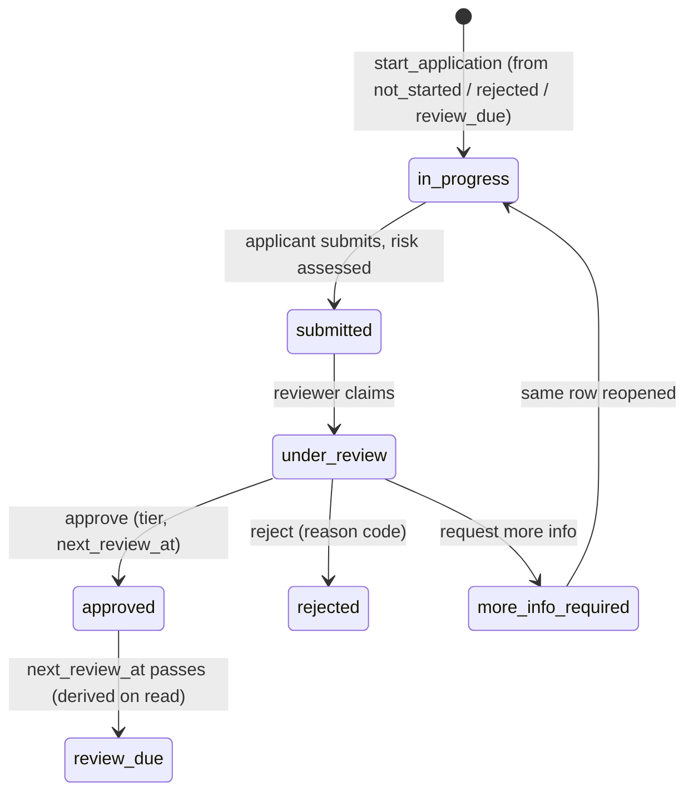

```mermaid
stateDiagram-v2
    [*] --> in_progress: start_application (from not_started / rejected / review_due)
    in_progress --> submitted: applicant submits, risk assessed
    submitted --> under_review: reviewer claims
    under_review --> approved: approve (tier, next_review_at)
    under_review --> rejected: reject (reason code)
    under_review --> more_info_required: request more info
    more_info_required --> in_progress: same row reopened
    approved --> review_due: next_review_at passes (derived on read)
```
