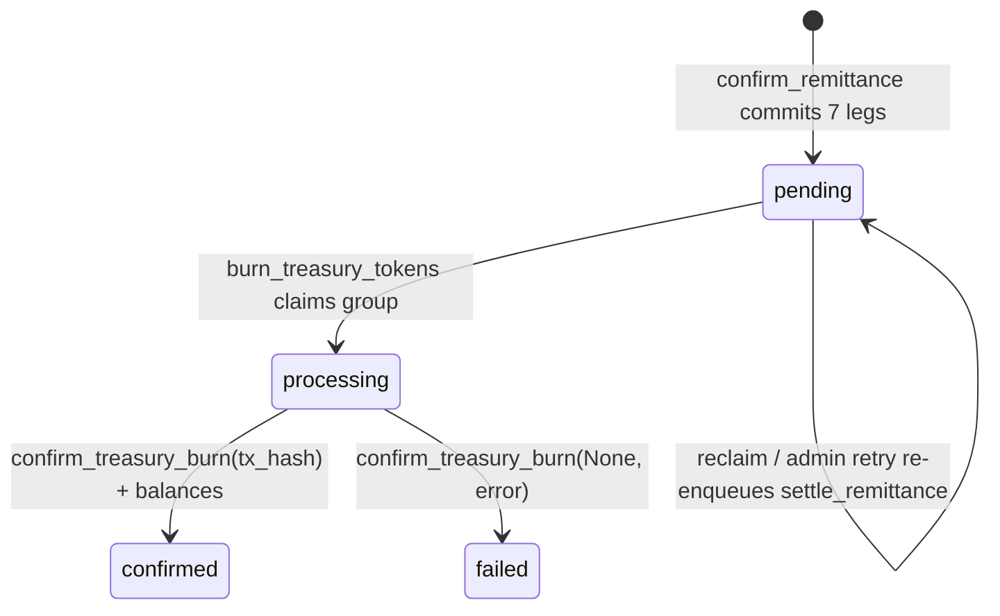

```mermaid
stateDiagram-v2
    [*] --> pending: confirm_remittance commits 7 legs
    pending --> processing: burn_treasury_tokens claims group
    processing --> confirmed: confirm_treasury_burn(tx_hash) + balances
    processing --> failed: confirm_treasury_burn(None, error)
    pending --> pending: reclaim / admin retry re-enqueues settle_remittance
```
