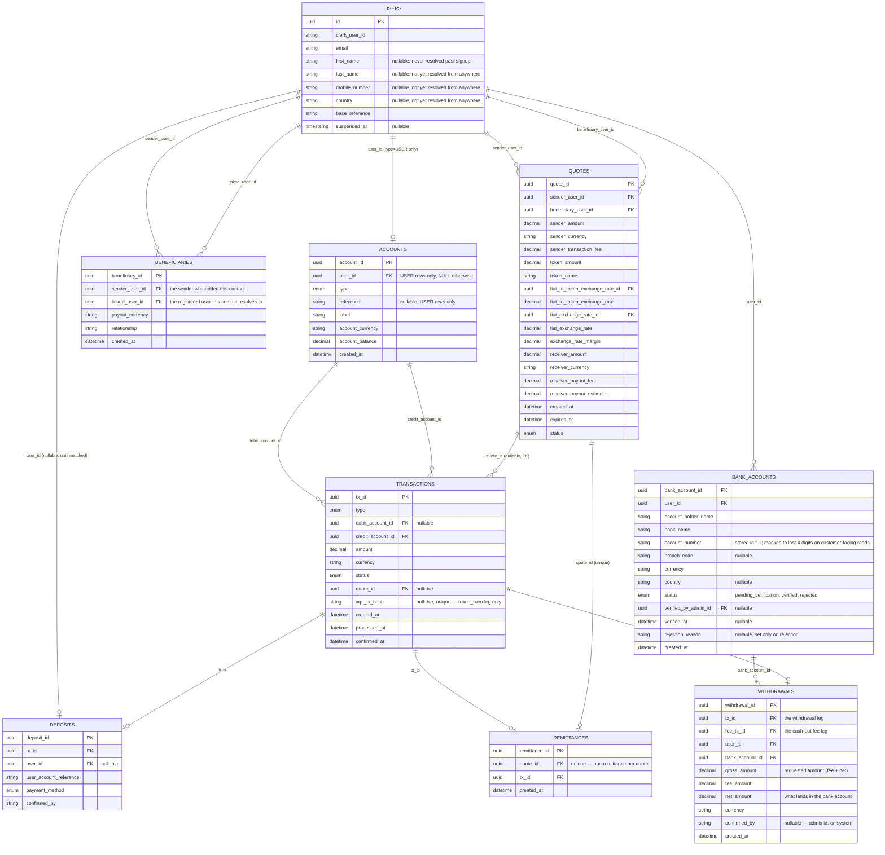

# RemitX — Transaction Model

Cross-border remittance prototype. Sender in South Africa pays ZAR, beneficiary in Zimbabwe receives ZWL, settled with `uctusd` tokens on the XRP Ledger Testnet.

---

## 1. Ledger Model

Every party that can hold money — a real user, or RemitX itself, or an external counterparty — is a row in `accounts`. Every movement of money — a deposit, a fee, a remittance leg, a withdrawal leg, a treasury top-up — is a row in `transactions`, debiting one account and crediting another. There is no separate `transfers`/`balances` split: `accounts` carries the current balance directly, `transactions` is the append-only history that produced it.

```sql
CREATE TABLE accounts (
    account_id       UUID PRIMARY KEY,
    user_id          UUID REFERENCES users(id),   -- the customer; type='USER' only, NULL otherwise
    type             VARCHAR(24) NOT NULL,          -- USER, REMITX_FIAT, REMITX_XRPL_WALLET,
                                                     -- REMITX_REVENUE, EXTERNAL
    reference        TEXT UNIQUE,                   -- e.g. "sian1-zar" — USER rows only
    label            TEXT NOT NULL,                 -- "sian1-zar (ZAR)", "RemitX SA Bank Account",
                                                     -- "RemitX XRPL Treasury Wallet", "RemitX SA Fee Revenue",
                                                     -- "UCTUSD Issuer (Exchange)"
    account_currency VARCHAR(8) NOT NULL,
    account_balance  NUMERIC(20,8) NOT NULL DEFAULT 0,
    created_at       TIMESTAMPTZ NOT NULL DEFAULT NOW(),

    CONSTRAINT ck_account_owner CHECK (
        (type = 'USER' AND user_id IS NOT NULL) OR (type <> 'USER' AND user_id IS NULL)
    ),
    CONSTRAINT ck_account_reference CHECK (
        (type = 'USER' AND reference IS NOT NULL) OR (type <> 'USER' AND reference IS NULL)
    ),
    CONSTRAINT ck_account_balance_nonneg CHECK (
        type <> 'USER' OR account_balance >= 0
    )
);
-- One row per (user_id, account_currency): a user with both ZAR and uctusd
-- activity has two account rows, not one multi-currency row.
CREATE UNIQUE INDEX ON accounts (user_id, account_currency) WHERE type = 'USER';
```

A `USER` account's `account_id` is its own independently-generated id — **not** the same value as `user_id`. `accounts.user_id` is a plain nullable FK, same shape as `Deposit.user_id` elsewhere in this codebase: for a `USER` row, the real customer it belongs to — required, and the foreign key makes it a real `users` row. `NULL` on every other row: RemitX's own platform accounts (`RemitX SA Bank Account`, `RemitX XRPL Treasury Wallet`, `RemitX SA Fee Revenue`, …) belong to no person, and neither does an `EXTERNAL` row like `UCTUSD Issuer (Exchange)`, the issuing address the lecturer pre-funds the Treasury Wallet from and every remittance settlement burns back to (§2, Phase C). The `accounts_owner_matches_type` CHECK enforces both halves. Staff holding `platform_account:read` (the `treasury_operator` role) see the platform accounts at `/admin/platform-accounts`.

RemitX keeps one real `REMITX_FIAT` bank account, and a matching `REMITX_REVENUE` fee account in the same currency, per country it settles fiat in — a fee earned on a ZAR transaction can no more land in a USD revenue account than a ZAR deposit could land in the USD bank account. Seeded by migration (`remitx_api/models/orm/platform_account_seed.py`, inserted by `alembic upgrade head`): `RemitX SA Bank Account` / `RemitX SA Fee Revenue` (ZAR), `RemitX US Bank Account` / `RemitX US Fee Revenue` (USD), `RemitX ZIM Bank Account` / `RemitX ZIM Fee Revenue` (ZWL), `RemitX NAM Bank Account` / `RemitX NAM Fee Revenue` (NAD) — plus the single `RemitX XRPL Treasury Wallet` (`uctusd`) and `UCTUSD Issuer (Exchange)` (`uctusd`), neither of which is per-country. Each `REMITX_FIAT` / `REMITX_REVENUE` pair stands for a single physical bank account in that currency, split into two ledger accounts so fees earned can be tracked apart from the float — see §7, "Platform accounts are ledger proxies for real bank accounts".

```sql
CREATE TABLE transactions (
    tx_id             UUID PRIMARY KEY,
    type              VARCHAR(24) NOT NULL,   -- deposit, treasury_funding, remittance, fee, withdrawal,
                                               -- token_burn, beneficiary_payout
    debit_account_id  UUID REFERENCES accounts(account_id),            -- destination; NULL while pending and unattributed
    credit_account_id UUID NOT NULL REFERENCES accounts(account_id),   -- source
    amount            NUMERIC(20,8) NOT NULL,   -- always positive
    currency          VARCHAR(8) NOT NULL,
    status            VARCHAR(16) NOT NULL,     -- pending, processing, confirmed, failed
    quote_id          UUID REFERENCES quotes(quote_id),   -- nullable; shared across every leg of one quote
    xrpl_tx_hash      TEXT UNIQUE,              -- set only on a confirmed token_burn leg (§2, Phase C)
    created_at        TIMESTAMPTZ NOT NULL DEFAULT NOW(),
    processed_at      TIMESTAMPTZ,
    confirmed_at      TIMESTAMPTZ,

    CONSTRAINT transactions_type_valid CHECK (type IN ('deposit', 'treasury_funding',
        'remittance', 'fee', 'withdrawal', 'token_burn', 'beneficiary_payout')),
    CONSTRAINT transactions_status_valid CHECK (status IN ('pending', 'processing',
        'confirmed', 'failed')),
    CONSTRAINT transactions_amount_positive CHECK (amount > 0)
);
```

**`credit` = source, `debit` = destination** — money always flows credit → debit. A `confirmed` row is append-only: a mistake or a failure already settled is corrected with a new row, never an `UPDATE` to its accounts or amount (see Write Rules, §3). A `pending` row hasn't settled anything yet, so it's fair game to fill in — e.g. a deposit's `debit_account_id` starting `NULL` and getting set once the destination is known (§2, Phase A).

**`account_balance` only ever changes as part of a guarded status transition**, never at plain insert time: `UPDATE transactions SET status='confirmed' WHERE tx_id=? AND status='pending'`, with the matching `accounts.account_balance` delta applied in the *same* commit. A row that's certain the moment it's written (a matched deposit — see §2, Phase A) is simply inserted straight as `'confirmed'` — insert-then-immediately-confirm, one commit, no real waiting. A row that's part of something whose overall outcome is still uncertain — every leg of a remittance, since the whole thing can still fail at settlement, not just its final hop — is inserted `'pending'` and stays that way until the outcome is known. When several rows need to resolve together, the guard widens from one `tx_id` to every row sharing a `quote_id`: `UPDATE transactions SET status='confirmed' WHERE quote_id=? AND status='pending'` (see §2, Phase C) — same idempotence, just applied to a group instead of a single row. This is the same guarded-update pattern already used by `remitx_worker/tasks.py::process_integration_message`, just widened.

**Non-negative balances are enforced twice** for `USER` accounts: an application-level check (`account_balance >= amount`, before writing any `transactions` row that would make this account the source, i.e. its `credit_account_id`) gives a clean "insufficient balance" error; the `ck_account_balance_nonneg` CHECK above is the backstop that turns a bug in that check into a hard rollback instead of silent corruption. Platform/external accounts are deliberately exempt — a treasury account may legitimately need to run negative internally. This is not enforces for platorm accounts because they are not user-facing, and the platform's own bank account is expected to run negative as a liability to its customers (§1, "Reading the balances: why RemitX's bank account runs negative").

**Currency consistency is enforced in code, not the database**: whatever writes a `transactions` row must itself verify `transactions.currency == debit_account.account_currency == credit_account.account_currency` — Postgres can't `CHECK` across two other tables' columns. Practical consequence: an FX conversion is always two `transactions` rows through an intermediary account (see Phase B below), never one row that changes currency mid-flight.

### Reading the balances: why RemitX's bank account runs negative

Every balance is the net amount that has flowed into that account: everything it received minus everything it sent. A customer's ZAR balance of 1,000 in their platform currency account is a claim they hold against RemitX: a liability to RemitX. The other side of that claim is the platform `REMITX_FIAT` account, which a deposit is taken *out of* (§2, Phase A). So `REMITX_FIAT` goes negative, and its magnitude is the money RemitX should be holding in that currency on behalf of its customers. RemitX's actual bank account balance would be postive.

**Worked example: R1,000 deposit, then a R400 withdrawal** (0.75% cash-out fee → R3.00 fee, R397.00 net):

| Step | Transaction (credit → debit) | Sipho ZAR | RemitX SA Fee Revenue | RemitX SA Bank Account | Sum | Cash in RemitX's real bank |
|---|---|---|---|---|---|---|
| Start | — | 0.00 | 0.00 | 0.00 | 0 | R0 |
| A. Deposit | RemitX SA Bank Account → Sipho ZAR, 1,000.00 | 1,000.00 | 0.00 | **−1,000.00** | 0 | R1,000 |
| E. Fee | Sipho ZAR → RemitX SA Fee Revenue, 3.00 | 997.00 | 3.00 | −1,000.00 | 0 | R1,000 |
| E. Withdrawal | Sipho ZAR → RemitX SA Bank Account, 397.00 | 600.00 | 3.00 | **−603.00** | 0 | R603 |

Reading each row:

- **Deposit.** R1,000 arrives in RemitX's real bank via a bank transfer from Sipho's bank account to RemitX. The ledger records it as the bank account going to −1,000 and Sipho's claim going to +1,000: RemitX holds R1,000 and owes Sipho R1,000.
- **Fee.** Nothing leaves the real bank. R3 of what RemitX owes Sipho becomes RemitX's own revenue. The bank account doesn't move; see "Why a fee doesn't touch the bank account" below.
- **Withdrawal.** R397 leaves the real bank for Sipho's own bank account (`withdrawals.bank_account_id`). The bank account moves *up*, towards zero, by 397, and Sipho's claim goes *down* by the same amount. **The platform balance going up and RemitX holding less customer money are the same event**: the asset and the liability both shrink by R397 as that money leave the system and is sent to Sipho's external bank account. What's left, R603, is exactly Sipho's R600 plus RemitX's R3 in fees.

**Why a fee doesn't touch the bank account.** It's tempting to expect `RemitX SA Bank Account` to drop by R3 when the fee is charged. It shouldn't, because the platform accounts do two different jobs:

- `REMITX_FIAT` tracks **how much cash there is**: the money sitting in RemitX's one physical bank account in that currency .
- The customer accounts and `REMITX_REVENUE` track **who that cash belongs to**: each customer's share, and RemitX's own share (fees earned).

`REMITX_FIAT` and `REMITX_REVENUE` are not two separate pots of cash. Both are slices of the same physical bank account (§7, "Platform accounts are ledger proxies for real bank accounts"). A fee changes who owns part of the cash, not how much cash there is. Before the fee, all R1,000 in the bank is Sipho's. After it, R997 is Sipho's and R3 is RemitX's, and the R1,000 is still sitting in the same bank account. So only the two ownership accounts move (Sipho −3, fee revenue +3), and `REMITX_FIAT` stays at −1,000 as technically the +3 in `REMITX_REVENUE` is a liability to `REMITX_FIAT` as they are considered two differnt platform accounts even thought they connect to the same underlying physical bank account.

If the fee *also* took R3 off `REMITX_FIAT`, it would need a second transaction with nothing on its other side. `REMITX_FIAT` would read −1,003, claiming RemitX holds R1,003 when only R1,000 ever arrived, and the three balances would sum to −3 instead of zero.

The general rule: **`REMITX_FIAT` moves only when money enters or leaves that currency's side of the ledger.** A deposit arriving takes it down, and a withdrawal payout leaving takes it back up. A remittance's net transaction also takes it up, because that ZAR is converted and paid out in another currency (see the remittance paragraph below). Transactions that only change who owns money already inside, like a fee, never touch it. The fee's R3 reaches `REMITX_FIAT` only when that cash physically leaves too. For example, if RemitX later moved its fee earnings from the bank to its own operating account, that would be a transaction out of `REMITX_REVENUE` into `REMITX_FIAT`: revenue drops by 3 and the bank account rises by 3, from −603 to −600, because R3 of cash really has left for external payment.

A remittance fits the same rule. Its fee and net transactions leave the sender's ZAR on the SA accounts, and its payout transaction is taken out of the destination country's bank account (§1, Worked example, transaction 7). Each currency still sums to zero on its own. The float that the SA account keeps from the net transaction is what funds, outside the ledger, the ZWL the ZIM account has paid out. So across currencies, −`REMITX_FIAT` is what the ledger says RemitX should hold in that currency, not a live bank feed.

### XRPL accounts and the `uctusd` / RLUSD relationship

Two XRPL Testnet accounts sit behind two `accounts` rows:

| Account | Role |
|---|---|
| `OPERATIONAL` (RemitX XRPL Treasury Wallet, `REMITX_XRPL_WALLET`) | The platform's own custodial wallet. Holds `uctusd` on RemitX's behalf. |
| `ISSUER` (`UCTUSD Issuer (Exchange)`, `EXTERNAL`) | The issuing address (`rELez4x4Zqv3KYqboYVfrYPF8521Ycbxa5`, `.env.example`'s `UCTUSD_ISSUER`). Per the course's clarifications: this is also the "exchange" — sending tokens here *is* handing them over, no separate mock exchange integration needed. |

`uctusd` stands in for RLUSD. The brief allows a "lecturer-approved test-token transfer" in place of RLUSD itself — the real Testnet RLUSD faucet is rate-limited, so the course issues `uctusd` instead (`.env.example` carries the same rationale next to `UCTUSD_ISSUER`). Everywhere this doc says `uctusd`, read it as RLUSD's stand-in.

`uctusd` is an issued currency, not XRP — an account can't hold it without a TrustLine to the issuer. `OPERATIONAL` holds exactly one: a `TrustSet` to `ISSUER`, opened once at wallet setup (`platform_wallet/scripts/create_xprl_platform_wallet.py`'s `create_trust_line` / `trust_line_exists`).

**The burn is the only on-chain leg.** Every remittance burns its `uctusd`: once the beneficiary pass-through leg lands the tokens back in `OPERATIONAL`, settlement submits a `Payment(OPERATIONAL → ISSUER)` for the remittance's `token_amount` (`burn_treasury_tokens`, §2 Phase C). Sending tokens back to the issuer destroys them. That payment is the *only* call anywhere in the system that touches the XRPL chain; every other leg, including crediting the beneficiary, is database bookkeeping. Nothing on the remittance confirms until the burn resolves, and withdrawals (§2 Phase E) never touch XRPL. There's no "buying" or minting step — the Treasury Wallet's starting `uctusd` balance is recorded once, as a real `treasury_funding` transaction crediting it from `ISSUER`, reflecting the actual on-chain balance the lecturer funded — not a per-remittance event. The `record treasury funding` migration (`a77cbaf94587`) reads it from the testnet for `PLATFORM_WALLET_ADDRESS` at deploy time, once per database; with no wallet configured the treasury starts at zero. Every other platform account starts at zero. See Open Question #1.

### Decimal precision

Three different precisions are in play, not one uniform one — see Open Question #10:

| Precision | What | Where it's set |
|---|---|---|
| **2dp** | Every *amount of money that actually moves* — `sender_amount`, `fee`, `margin`, `token_amount` (uctusd included), `receiver_amount`, `payout_fee`, `payout_estimate`, and every `transactions.amount` leg derived from them | `quote_service.AMOUNT_QUANTUM` (`Decimal("0.01")`) via `round_amount()`, `ROUND_HALF_UP` |
| **8dp** | `fiat_to_token_exchange_rate` — the inverted rate (token units per 1 unit of sender currency) `_token_rate()` computes itself | Explicit `.quantize(Decimal("0.00000001"))` in `quote_service._token_rate` |
| **Unrounded (provider precision)** | `fiat_exchange_rate` (the direct sender→payout rate) and the raw `ExchangeRate.rate` row `_token_rate` inverts | `exchange_rate_provider.py` stores `Decimal(str(payload["conversion_rate"]))` straight through, no `.quantize()` |

The columns underneath (`accounts.account_balance`, `transactions.amount`, `quotes.*`) all stay `Numeric(20,8)` — nothing narrows them. Application code simply never writes more than 2dp of an *amount* into them any more, which is what stops SQLite (tests) and Postgres (prod) disagreeing on a stored value. Rates are deliberately left out of this — rounding a rate to 2dp before multiplying it against a large sum would throw away real accuracy, and a rate is never itself a balance that has to reconcile.

**Worked example — R100 ZAR sent, beneficiary payout in ZWL** (illustrative rates: USD/ZAR = 18.50, ZAR/ZWL = 16.22; current fee config: R15 fixed, 0.5% percentage, 1% FX margin, 0.75% cash-out):

Quote fields (`quotes` row, §2 Phase B1):

| Field | Calculation | Value | Precision |
|---|---|---|---|
| `sender_amount` | input, rounded on entry | 100.00 ZAR | 2dp |
| `sender_transaction_fee` | 15 + 0.5%×100 → round | 15.50 ZAR | 2dp |
| `exchange_rate_margin` | 1%×100 → round | 1.00 ZAR | 2dp |
| net (intermediate, not stored) | 100.00 − 15.50 − 1.00 | 83.50 ZAR | 2dp |
| `fiat_to_token_exchange_rate` | 1 ÷ 18.50 → quantize | 0.05405405 | 8dp |
| `token_amount` | 83.50 × 0.05405405 → round | 4.51 uctusd | 2dp |
| `fiat_exchange_rate` | direct ZAR/ZWL fetch, unrounded | 16.22 | provider precision |
| `receiver_amount` | 83.50 × 16.22 → round | 1354.37 ZWL | 2dp |
| `receiver_payout_fee` | 0.75%×1354.37 → round | 10.16 ZWL | 2dp (a display estimate on the quote; the real charge happens at withdrawal time, §2 Phase E — Open Question #13, resolved) |
| `receiver_payout_estimate` | 1354.37 − 10.16 | 1344.21 ZWL | 2dp |

The seven ledger legs it produces (`transactions` rows, §2 Phase B2/C) — all `Numeric(20,8)` columns, every one holding a 2dp value:

| Leg | Credit → Debit | Amount | Currency |
|---|---|---|---|
| 1. Fee | Sender ZAR → RemitX SA Fee Revenue | 16.50 (fee + margin) | ZAR |
| 2. Net remittance | Sender ZAR → RemitX SA Bank Account | 83.50 | ZAR |
| 3. Treasury pass-through in | Treasury Wallet → Sender uctusd | 4.51 | uctusd |
| 4. Settlement | Sender uctusd → Beneficiary uctusd | 4.51 | uctusd |
| 5. Treasury pass-through out | Beneficiary uctusd → Treasury Wallet | 4.51 | uctusd |
| 6. Burn (on-chain) | Treasury Wallet → UCTUSD Issuer | 4.51 | uctusd |
| 7. Payout | RemitX ZIM Bank Account → Beneficiary ZWL | 1354.37 | ZWL |

The only 8dp number anywhere in the flow is the internal rate (0.05405405) used once to compute the 4.51 uctusd leg — it's never itself moved as a balance.

Transactions 2 and 7 leave RemitX's SA bank account R83.50 ahead of what the ledger says it needs, and the ZIM bank account ZWL 1,354.37 behind. The cash between the two is settled later, off-ledger, and the ZIM bank pays out from a float until then. See §7, "Cross-border cash is settled periodically, off-ledger".

---

## 2. The Flow

Assumes both parties are registered and KYC-approved (`KycApplicationRepository.get_standing` is what answers that). Sender tops up a ZAR balance, then sends from it — deposits and remittances are independent, so one top-up can fund several sends.

### Phase A — Sender deposits ZAR

Every user is issued a `User.base_reference` at signup — first name, lowercased and capped at 8 characters, plus a disambiguating number, e.g. Sipho's `sipho1`. It's never itself an EFT reference; instead, both of the user's accounts (created together, eagerly, in the same transaction as signup) get their own `accounts.reference` by appending a currency suffix to it — Sipho's ZAR account is `sipho1-zar`, his `uctusd` account `sipho1-tok`. It's the `-zar` one he quotes on every ZAR EFT, for life. Money paid into RemitX's USD, ZWL or NAD bank account quotes his reference in that currency, once he holds one; the `-tok` one is never depositable into directly (a statement line is only ever matched to an account in its own currency — see A2).

**A1. Sender pays** *(off platform)* — EFT into RemitX SA's bank account, reference = the sender's ZAR account reference (`sipho1-zar`). Nothing in the platform's database changes yet.

**A2. Admin reconciles** *(daily, against the RemitX SA bank statement — simulated, admin pushes a "Process Deposits" button on the admin portal)*. For the sake of this project, cash-in reconciliation is simulated and executed via that admin button rather than genuinely reading a live bank feed — in reality this would be a daily cron job that runs `process_deposits` on a schedule, with the button standing in for it. Every statement line gets a `deposits` row **and** a `transactions` row immediately, whether or not it matches — the arrival is a fact either way, only its destination might be uncertain. Each line carries the currency of the RemitX bank account it came into (the statement CSV's `currency` column), and the transaction is recorded in it, out of that bank account. Matching looks up an `accounts` row by reference and accepts it only if it is in the line's currency, so R1,000 quoting `sipho1-usd` or `sipho1-tok` is never credited as $1,000 or as 1,000 tokens:

- **Match** → `transactions`: credit `RemitX SA Bank Account` (RemitX's bank account in the line's currency), debit **Sipho's ZAR account**, type `deposit`, **confirmed**, amount 1000.00. `deposits` → new row, `tx_id` set, `user_id` set, `confirmed_by = 'system'`.
- **No match** (including a reference to an account in another currency) → `transactions`: credit `RemitX SA Bank Account` (as above), `debit_account_id` **NULL**, type `deposit`, **pending**, amount 1000.00 — the source of the money is known, the destination isn't, yet. `deposits` → new row, `tx_id` set (this same row), `user_id` **NULL**, `confirmed_by` NULL.
- **No currency, or one RemitX doesn't bank in** → skipped, nothing written. The admin fixes the line and uploads the statement again.

**A3. Admin resolves an unmatched deposit** *(manual, from the admin portal, reviewing the sender's proof of payment)*. This **updates that same `transactions` row** — guarded `UPDATE transactions SET debit_account_id = <Sipho's ZAR account>, status = 'confirmed' WHERE tx_id = ? AND status = 'pending'`, in the same commit as increasing Sipho's `account_balance`. `deposits.user_id` and `confirmed_by` (the admin's id) get set at the same time. The account the admin picks must be in the deposit's currency; any other is refused. Nothing about this is a mutation of settled history — the row hadn't posted anything while it was `pending`, so filling in its destination now doesn't erase a fact the way editing a `confirmed` row would.

Sender's ZAR balance is 1,000. Nothing on chain. No tokens exist yet.

### Phase B — Sender pays the beneficiary (remittance)

**B1. Request a quote** — `quotes`: sender's ZAR account, beneficiary's `uctusd` account (exists from signup — see §2, Phase A), mid rate 18.50, fee 20.00, margin 10.00, net 970.00, settlement **52.432432 uctusd**, `ACTIVE`, expires in 15 min. Issued only to a verified sender, from any fiat account they hold, for an amount that fits what is left of their daily and monthly allowance in rand (§7, sending limits).

**B2. Sender confirms** (`services/remittance_service.py::confirm_remittance`) — first, under a row lock on the sender, a guarded `quotes` transition (`WHERE quote_id=? AND status='ACTIVE' AND expires_at > ?`) flips the quote to **USED**, and the sender's KYC standing and what is left of their allowance are checked again, since both can change after a quote is issued (a refusal rolls the quote back to `ACTIVE`); only once those succeed does one commit insert a `remittances` row and every leg it needs — **all seven inserted `pending`**, sharing one `quote_id`, and none of them touching a balance yet (nor, per Phase C below, until the burn leg's on-chain call actually resolves):

- `transactions` → credit Sipho's ZAR account, debit `RemitX SA Fee Revenue`, amount 30.00, type `fee`, **pending**
- `transactions` → credit Sipho's ZAR account, debit `RemitX SA Bank Account`, amount 970.00, type `remittance`, **pending**
- `transactions` → credit `RemitX XRPL Treasury Wallet`, debit **Sipho's `uctusd` account**, amount 52.432432, type `remittance`, **pending**
- `transactions` → credit **Sipho's `uctusd` account**, debit **Tendai's `uctusd` account**, amount 52.432432, type `remittance`, **pending** — this is the row `remittances.tx_id` (`NOT NULL`) points at. Deliberately *not* the payout leg below, even though the payout is what actually represents "has this remittance reached the beneficiary" — this leg and the payout confirm in the same commit either way (§2, Phase C), so it makes no difference today; it's the more future-proof choice if the payout is ever decoupled from the burn's confirmation later (e.g. once it involves a real external payment call of its own), since this leg's status can never be `confirmed` while the beneficiary's real-world payout is still pending or has failed downstream.
- `transactions` → credit **Tendai's `uctusd` account**, debit `RemitX XRPL Treasury Wallet`, amount 52.432432, type `remittance`, **pending** — completes Tendai's own pass-through, mirroring Sipho's
- `transactions` → credit `RemitX XRPL Treasury Wallet`, debit `UCTUSD Issuer (Exchange)`, amount 52.432432, type `token_burn`, **pending** — the on-chain leg (§2, Phase C) that actually destroys the tokens the line above just landed back in the treasury
- `transactions` → credit `RemitX ZIM Bank Account`, debit **Tendai's ZWL account**, amount (the quote's `receiver_amount`, converted directly via `fiat_exchange_rate` — not routed through the token leg), type `beneficiary_payout`, **pending**

`remittances` is deliberately lean (`remittance_id`, `quote_id` — FK, UNIQUE — `tx_id`, `created_at`; see §3): every priced field (`fx_rate`, `fee_amount`, token amounts, currencies) is already frozen on the `quotes` row it confirms, so nothing here duplicates it, and "who confirmed it" is already `quotes.sender_user_id` — `confirm_remittance` only ever confirms a quote against its own sender, so a separate `confirmed_by` column would just be the same value stored twice. A remittance's receipt is the controller joining `remittances` + `quotes`, not extra storage.

**The beneficiary never holds a resting `uctusd` balance** — a deliberate deviation from the brief's literal "recipient holds and views RLUSD, then chooses when to cash out" wording (§4.7). Tendai's `uctusd` account is a momentary pass-through exactly like Sipho's own: legs 4-5 credit it then debit the same amount straight back to the treasury, nets to zero once both confirm. The payout leg (7) auto-converts the settled amount into Tendai's own ZWL account instead — no separate withdrawal action needed to reach fiat — but only once the burn leg (6) has actually destroyed the equivalent tokens on-chain (§2, Phase C). `Tendai's ZWL account` is provisioned lazily, inside `confirm_remittance`, the first time he receives money in that currency (not at signup — only ZAR + `uctusd` are eager). The cash-out fee (`Config.CASH_OUT_FEE_RATE`, already computed on every quote as `receiver_payout_fee`) is **not** deducted here — deferred to the real withdrawal-from-the-platform flow (§2, Phase E), which deducts it against the actual requested amount at withdrawal time, not this estimate.

Sipho's `uctusd` account nets to exactly zero across its two token legs, once they confirm — it's a momentary pass-through that exists so the sender's own activity history shows the tokens they sent, not a balance they ever actually held.

**Nothing about this remittance is final yet — not even the fee.** No account's `account_balance` moves at B2; every one of these seven rows is still waiting on Phase C. The balance-check consequence this has (Sipho's ZAR balance hasn't actually dropped yet) is fully closed as of this confirmation step — see §8 Open Question #5.

Then, only after that commit returns, `queue_service.enqueue_settle_remittance(quote_id)` enqueues the Celery task `remitx_worker.tasks.settle_remittance` onto the Redis-backed `settlement` queue — keyed on `quote_id`, not `remittance_id`, since that's the only thing the group-confirm guard in C3 actually needs.

### Phase C — Settlement

B2 now inserts **seven** pending legs, not six: a `token_burn` leg (credit `RemitX XRPL Treasury Wallet`, debit `UCTUSD Issuer (Exchange)`, same `token_amount` as the beneficiary pass-through leg) sits between the beneficiary pass-through and the payout, and the old 6th leg's `type` is `beneficiary_payout`, not `remittance`, so it's addressable on its own. **Nothing confirms and no balance moves for any of the seven until the on-chain burn resolves** — settlement is now three Celery tasks, but only the last one ever writes a `confirmed` or `failed` status. Gating the whole group on the burn, not just the payout, means a failed burn needs no reversal: since nothing was ever credited, failing the group is a pure status flip.

**C1. `remitx_worker.tasks.settle_remittance` just hands off.** It confirms nothing itself — it checks whether the quote's `token_burn` leg is still `pending` (a plain read, not a guarded UPDATE, since this task doesn't transition anything itself) and, if so, enqueues `burn_treasury_tokens(quote_id)`. If the burn leg is no longer `pending` (already claimed, or the whole group already resolved), it's a no-op. The real idempotency guard for the pipeline lives one step further in, on the burn leg's own claim.

**C2. `remitx_worker.tasks.burn_treasury_tokens` claims the whole group and submits the burn to the chain.** Guarded transition `pending -> processing` (a new status, not the usual `pending -> confirmed`) is that claim — `processing` exists specifically because, unlike every other leg in this file, there's now a real network call sitting between "claimed" and "done," so the usual single-guard-and-go isn't enough to stop a redelivered task submitting the same burn twice while the first is still in flight. The claim covers every one of the quote's seven pending legs at once, not just the burn leg — so `processed_at` gets stamped on all seven together, reflecting when settlement actually started rather than only the one leg with a network call in it. Once claimed, it submits `Payment(RemitX XRPL Treasury Wallet → UCTUSD Issuer (Exchange))` to the XRPL testnet (`remitx_worker/xrpl_service.py::burn_tokens`) — the only burn in the system, and the only XRPL call. It does nothing else with the result: recording it is handed to a third, purely-DB task, so that step never shares a task invocation with a slow external call and can be retried entirely on its own. Enqueues `confirm_treasury_burn(quote_id, tx_hash)` on success, or `confirm_treasury_burn(quote_id, None, error)` if the XRPL call raised — `error` is the exception's own message, logged (`logger.exception`, with the burn amount) at the point of failure and carried forward so C3's own failure log states the actual reason, not just the fact that it failed.

**C3. `remitx_worker.tasks.confirm_treasury_burn` settles — or fails — every leg together.** No network call, so trivially safe to retry. Guarded on `status IN ('pending', 'processing')` across the whole `quote_id` group — by this point every leg already sits in `processing`, claimed together in C2 — so one guarded UPDATE catches all seven, and a redelivered message matches nothing once the first delivery committed:

- `tx_hash` present → one commit: all seven legs `-> confirmed`, the burn leg's `xrpl_tx_hash` set, and every leg's destination account credited in the same follow-up loop `settle_remittance` used to run alone — `RemitX SA Fee Revenue` +30.00, `RemitX SA Bank Account` +970.00, Sipho's `uctusd` account +52.432432 then back to 0, Tendai's `uctusd` account +52.432432 then back to 0, `RemitX XRPL Treasury Wallet` +52.432432 (no longer nets back to zero — it now holds the tokens the burn just destroyed), `UCTUSD Issuer (Exchange)` +52.432432, Tendai's ZWL account +`receiver_amount`. This is the literal implementation of "nothing settles until the burn is confirmed, and we have its hash."
- `tx_hash` is `None` (the burn failed) → all seven legs `-> failed`, in one commit, with **no balance changes at all** — every leg was still `pending`/`processing`, so there was nothing to undo. Logged at `logger.error`, with `error` from C2, so the reason is visible next to the group that got marked `failed`. The failed group still just sits there for manual investigation, though — there's no automatic retry/reclaim for a stuck `transactions` row yet, only visibility into the fact that one exists. See Open Question #14.

See Open Question #1.

### Phase D — Beneficiary sees funds

`GET /accounts` lists every currency account Tendai holds — ZAR and `uctusd` from signup, plus his now-provisioned ZWL account — each with its available balance (raw `accounts.account_balance` minus that account's own still-`pending`/`processing` outgoing legs, same check quotes/remittances use — §8 Open Question #5). His ZWL entry reads the settled `receiver_amount`; his `uctusd` entry reads 0 once settlement confirms, since Phase C already swept it back to the treasury. `GET /accounts-history?account_id=...` then lists one account's legs (incoming/outgoing, status, date) for a given `account_id` from that list. There's no separate "wallet" table or concept — this is a read view over the same `accounts`/`transactions` rows described in §1.

### Phase E — Withdrawal: a user's own fiat balance to an external bank account

**Built** (`services/withdrawal_service.py`, `services/bank_account_service.py`). Remittance settlement (§2 Phase C) already burns the tokens and lands fiat straight in the beneficiary's own currency account, so no user ever holds a resting token balance and there is nothing to burn by the time anyone withdraws. A withdrawal is a pure ledger movement between a user's own fiat account and RemitX's platform fiat account, plus a mock external bank payout — it never touches XRPL. (This also finally closes Open Question #13: the cash-out fee is charged here, at request time — see E1.)

**No KYC or suspension check on withdrawals**, deliberately: see §7, "Withdrawals don't check KYC standing or suspension".

The one thing this section got right and still holds: **no manual admin-approval gate on the withdrawal itself** — "holding a customer's own money hostage behind a human clicking a button isn't something this design does." What changed is *where* the one real trust decision lives. It's not "is this withdrawal OK" (checked automatically — available balance is all that governs it), it's "does this bank account actually belong to this person" — a new `bank_accounts` table (one row per external account a user has added, `pending_verification` → `verified` / `rejected`; this is the `bank_acc_id` this doc's `withdraws` row always pointed at but never had a table for).

**Revised again, same branch:** a withdrawal now requires the destination bank account to *already* be `verified` — it's refused outright (400) otherwise, never held `pending` waiting on an admin. There is no admin processing queue for withdrawals any more (`GET /admin/withdrawals/pending`, `POST .../verify-and-process`, `POST .../fail` are all gone); the frontend's withdrawal page never gives a user the option to withdraw into an unverified account in the first place, so in the normal flow this refusal path never fires. Verifying/rejecting a bank account (`POST /admin/bank-accounts/{id}/verify`/`.../reject`) is still the one manual gate anywhere in this doc, but it no longer cascades into settling or failing anything — since no withdrawal can ever be pending against an account that was never verified, there's nothing left for verification to settle.

**E1. User requests a withdrawal** *(customer-facing, `POST /withdrawals`)*. The frontend gets there by way of `GET /bank-accounts/withdrawable?currency=...` — the caller's `verified` bank accounts in that currency, i.e. exactly the set that can be chosen as a destination (`GET /bank-accounts?currency=...`, without the `verified` filter, is the separate "manage my bank accounts" view, which still shows a `pending_verification`/`rejected` account so the user can see its status). `request_withdrawal` re-validates regardless of what the picker already filtered: the bank account must belong to the caller, be `verified` (`BankAccountNotVerifiedError` if still `pending_verification`, `BankAccountRejectedError` if `rejected` — 400 for unverified, 409 for rejected, and both only reachable via a direct API call or an account that gets rejected in the gap between the picker loading and the request landing), be denominated in the same currency as the fiat account being withdrawn from, and `AccountRepository.get_available_balance_locked` must cover the requested amount — the same available-balance check (raw balance minus that account's own still-`pending` outgoing legs) every other phase in this doc uses, plus a row lock on the account so a second concurrent request against it can't pass the same check before this one commits (§8, Open Question #15). One commit: a `withdrawals` row (`tx_id`, `fee_tx_id`, `bank_account_id`, `gross_amount`, `fee_amount`, `net_amount`, `currency`, `confirmed_by` — leaner than the old `withdraws`, no more `payout_method`/free-text `bank_acc_id`, and no `payout_reference` any more either — a mock reference string added nothing over `withdrawal_id` itself, so it was dropped rather than stored; `net_amount` is stored rather than recomputed from the other two, since it's what actually lands in the bank account) plus two `pending` legs, both crediting the user's own fiat account — inserting them `pending` is what locks the funds, without touching `account_balance` yet, exactly the pattern that stops the same money being withdrawn twice while a deposit or remittance leg is still in flight elsewhere in this doc:

- `transactions` → type `fee`, credit the user's fiat account, debit RemitX's fee revenue account (`REMITX_REVENUE`) for that currency — the same kind of account a remittance fee lands in (§1) — amount `max(Config.CASH_OUT_FEE_RATE * amount, Config.MIN_CASH_OUT_FEE)` (rounded to 2dp), off the gross requested amount. Every withdrawal writes this leg, and a transaction amount must be positive, so the fee never drops below `MIN_CASH_OUT_FEE` (0.01) and the smallest withdrawal is that plus 0.01 (0.02), so the net leg below is never zero. **Provisional — see Open Question #16.**
- `transactions` → type `withdrawal`, credit the user's fiat account, debit RemitX's platform fiat account (`REMITX_FIAT`) for that currency, amount = requested amount minus the fee.

Since the bank account is already known to be `verified` by this point, **settlement happens synchronously, inline, in this same request** (E2, called directly — no queue, no worker, no admin step, the same sequential-function-call shape as `deposit_service.approve_pending_deposit`).

**E2. Settle** (`withdrawal_service._settle_withdrawal`, called inline from E1 — the only caller now) — guarded `pending -> confirmed` on both legs at once: one `UPDATE ... WHERE tx_id IN (fee leg, withdrawal leg) AND status = 'pending'` (`TransactionRepository.confirm_pending_transactions`), which only counts as settled if *both* rows changed. If either is no longer `pending`, the session is rolled back — undoing the other leg if this call had just confirmed it — and `WithdrawalNotPendingError` is raised, so a withdrawal can never end up half-settled or settled twice. On success, in the same commit, the user's fiat `account_balance` is decreased by the gross amount and `REMITX_REVENUE` increased by the fee and `REMITX_FIAT` by the net amount (one balance movement per transaction). **The `withdrawal` transaction is the (mock) external payout.** `REMITX_FIAT` holds the negative of the money RemitX holds (a deposit took it below zero), so moving it up towards zero by the net amount is that money leaving RemitX's bank for the user's real bank account (`withdrawals.bank_account_id`). Nothing else touches `REMITX_FIAT`: its balance equals its confirmed transactions and all balances still sum to zero. See §1, "Reading the balances", for the deposit-then-withdrawal example. Records `confirmed_by` — always `"system"` now that nothing else settles a withdrawal; kept as a text column rather than dropped, both for parity with `Deposit.confirmed_by`'s shape and in case a future change ever needs an admin action to record itself against a withdrawal directly. No longer mints a `payout_reference` at all: it used to be a mock string derived purely from `withdrawal_id` (`f"WD-{withdrawal_id[:10].upper()}"`) — a display-only decoration that added no real information over `withdrawal_id` itself — so the whole column and API field were dropped rather than kept around as dead weight.

**Bank-account permissions.** The admin bank-account endpoints (`routes/admin/bank_accounts.py`) are gated by the `payout_operator` role's `cashout:*` permissions (`models/orm/rbac_seed.py`):

| Endpoint | Permission |
|---|---|
| `GET /admin/bank-accounts/pending` — list accounts awaiting a decision (full account numbers) | `cashout:read` |
| `POST /admin/bank-accounts/{id}/verify` — records the verifying admin and time | `cashout:read` + `cashout:approve` |
| `POST /admin/bank-accounts/{id}/reject` — records the admin and the reason | `cashout:read` + `cashout:fail` |

The customer endpoints (`POST /bank-accounts`, `GET /bank-accounts`, `GET /bank-accounts/withdrawable`, `POST /withdrawals`, `GET /withdrawals`) need only a signed-in customer, and only ever see the caller's own rows.

**Admin visibility** (`GET /admin/withdrawals/users/{user_id}`, `payout_operator` role, `cashout:read`) — the admin portal's user-profile page: every withdrawal a given customer has made, for an operator looking at their account. There's nothing left for an admin to *action* on a withdrawal itself, only to view.

**Deliberately not built yet: async settlement.** E2 runs inline and synchronously as part of E1 — there is no `remitx_worker` task and no message-queue hop anywhere in this flow, unlike remittance settlement (§2 Phase C), which is what the brief specifically grades on that requirement. If a real payment-gateway call is ever added to the payout leg, settlement should move to the same `queue_service` + worker-task pattern remittance settlement uses, claiming `pending` rows with the same guarded-update idempotency this doc relies on everywhere else.

**Why not now, though.** Honestly — right now, close to none. Async settlement earns its keep when there's a slow or flaky external call to decouple from the request (a real bank payment API, network retries, the request returning fast while the actual work happens in the background). The withdrawal flow has no such call today — it's pure, fast, deterministic DB work (confirm two rows, move two balances), so making it async would just add a queue hop and response-semantics complexity (`"pending"` instead of `"confirmed"`, tests needing rework) for no real gain.

The one legitimate justification is forward-looking: if this ever grows a real payment-gateway integration (the "possible evolution" flagged above), that's the point where async starts paying for itself — retries on failure, not blocking the request thread on a flaky external call. But building that decoupling now, before there's an actual slow dependency to decouple from, is solving a problem that doesn't exist yet.

---

## 3. Database Tables



```sql
CREATE TABLE deposits (
    deposit_id             UUID PRIMARY KEY,
    tx_id                  UUID NOT NULL REFERENCES transactions(tx_id),
    user_id                UUID REFERENCES users(id),   -- NULL until matched
    user_account_reference TEXT,                          -- raw reference string from the bank statement
    payment_method         VARCHAR(16) NOT NULL,          -- cash, bank_transfer, card
    confirmed_by           TEXT CHECK (... shape ...),  -- admin user id or 'system'; Postgres trigger validates users.id
    statement_fingerprint  TEXT NOT NULL UNIQUE           -- UTC date, reference, amount and currency; blocks re-import
);

CREATE TABLE remittances (
    remittance_id UUID PRIMARY KEY,
    quote_id      UUID NOT NULL UNIQUE REFERENCES quotes(quote_id),
    tx_id         UUID NOT NULL REFERENCES transactions(tx_id),
    created_at    TIMESTAMPTZ NOT NULL DEFAULT NOW()
);

-- A user's external bank account, the withdrawal destination `withdraws`
-- always referenced as `bank_acc_id` but never had a table for. Starts
-- pending_verification; only an admin verifying or rejecting it moves it
-- out of that state (§2 Phase E) — the one manual gate anywhere in the
-- withdrawal flow. TODO: no admin portal page lists these yet — only the
-- API exists (`GET /admin/bank-accounts/pending`, `POST .../verify`,
-- `POST .../reject`); a page needs building so an admin can actually work
-- this queue, same as the existing "Process Deposits" page does for deposits.
--
-- account_number is stored and transmitted unencrypted — a prototype
-- simulating cash-out, same trust boundary as the rest of the ledger; a
-- real account number would need the encrypted-at-rest treatment the brief
-- requires for XRPL keys. It IS masked to its last 4 digits (`****7890`) on
-- the customer-facing GET /bank-accounts* endpoints (routes/bank_accounts.py)
-- — display-only, done at the route layer, the stored value is untouched.
-- The admin endpoints (routes/admin/bank_accounts.py) still return it in
-- full, since verifying an account means actually checking this value.
CREATE TABLE bank_accounts (
    bank_account_id      UUID PRIMARY KEY,
    user_id              UUID NOT NULL REFERENCES users(id),
    account_holder_name  TEXT NOT NULL,
    bank_name            TEXT NOT NULL,
    account_number       TEXT NOT NULL,
    branch_code          TEXT,
    currency             TEXT NOT NULL,
    country              TEXT,
    status               TEXT NOT NULL DEFAULT 'pending_verification',
    verified_by_admin_id  UUID REFERENCES users(id),
    verified_at          TIMESTAMPTZ,
    rejection_reason     TEXT,
    created_at           TIMESTAMPTZ NOT NULL DEFAULT NOW()
);

CREATE TABLE withdrawals (
    withdrawal_id    UUID PRIMARY KEY,
    tx_id            UUID NOT NULL REFERENCES transactions(tx_id),
    fee_tx_id        UUID NOT NULL REFERENCES transactions(tx_id),
    user_id          UUID NOT NULL REFERENCES users(id),
    bank_account_id  UUID NOT NULL REFERENCES bank_accounts(bank_account_id),
    gross_amount     NUMERIC(20,8) NOT NULL,  -- requested amount (fee + net)
    fee_amount       NUMERIC(20,8) NOT NULL,
    net_amount       NUMERIC(20,8) NOT NULL,  -- what lands in the bank account
    currency         TEXT NOT NULL,
    confirmed_by     TEXT,                    -- always 'system'
    created_at       TIMESTAMPTZ NOT NULL DEFAULT NOW()
);

-- A sender's beneficiary contact. first_name/last_name/email/mobile_number/
-- country are deliberately NOT columns here — a beneficiary must already be
-- a registered user, so those are read from `users` via a join wherever a
-- beneficiary is displayed, rather than duplicated and risking staleness if
-- that user later updates their own details.
CREATE TABLE beneficiaries (
    beneficiary_id   UUID PRIMARY KEY,
    sender_user_id   UUID NOT NULL REFERENCES users(id),   -- the sender who added this contact
    linked_user_id   UUID NOT NULL REFERENCES users(id),   -- the registered user this contact resolves to
    payout_currency  VARCHAR(8) NOT NULL,                  -- USD, ZWL, or NAD
    relationship     VARCHAR(16) NOT NULL,                 -- partner, parent, child, sibling, relative, friend, employee, other
    created_at       TIMESTAMPTZ NOT NULL DEFAULT NOW()
);

CREATE TABLE quotes (
    quote_id               UUID PRIMARY KEY,
    -- References the people, not a frozen ledger row — the actual
    -- currency-scoped account is resolved on demand wherever it's needed.
    sender_user_id         UUID NOT NULL REFERENCES users(id),
    beneficiary_user_id    UUID NOT NULL REFERENCES users(id),
    sender_amount          NUMERIC(20,8) NOT NULL,
    sender_currency        VARCHAR(8) NOT NULL,
    sender_transaction_fee NUMERIC(20,8) NOT NULL,
    token_amount           NUMERIC(20,8) NOT NULL,
    token_name             VARCHAR(8) NOT NULL,
    -- Required: token units per 1 sender_currency (the inverse of
    -- sender_currency's USD quote — multiply, don't divide, for
    -- token_amount). Id null only for USD (peg needs no lookup).
    fiat_to_token_exchange_rate_id UUID REFERENCES exchange_rates(id),
    fiat_to_token_exchange_rate    NUMERIC(20,8) NOT NULL,
    -- Required: direct sender_currency <-> receiver_payout_currency rate,
    -- always backed by a real ExchangeRate row, even when the two
    -- currencies match. Doesn't feed settlement math.
    fiat_exchange_rate_id  UUID NOT NULL REFERENCES exchange_rates(id),
    fiat_exchange_rate     NUMERIC(20,8) NOT NULL,
    exchange_rate_margin   NUMERIC(20,8) NOT NULL,
    receiver_amount        NUMERIC(20,8) NOT NULL,
    receiver_currency      VARCHAR(8) NOT NULL,
    receiver_payout_fee    NUMERIC(20,8) NOT NULL,
    receiver_payout_estimate NUMERIC(20,8) NOT NULL,
    created_at             TIMESTAMPTZ NOT NULL DEFAULT NOW(),
    expires_at             TIMESTAMPTZ NOT NULL,
    status                 VARCHAR(16) NOT NULL   -- ACTIVE, USED, EXPIRED
);
```

| Table | Purpose |
|---|---|
| `accounts` | Every party that can hold a balance — real users and platform/external parties alike. §1. |
| `transactions` | Every movement of money. The only table with a `status` lifecycle. §1. |
| `deposits` | ZAR cash-in header. One row, one linked `transactions` row, always — an unmatched deposit's `debit_account_id` just starts `NULL` and gets filled in on resolution (§2, Phase A). |
| `remittances` | The send. `tx_id` points at the one leg whose `status` represents whether the whole remittance settled. |
| `bank_accounts` | A user's external bank account, `pending_verification` until an admin verifies or rejects it (§2, Phase E) — the only manual gate anywhere in the withdrawal flow. No admin portal page exists yet to work this queue — only the API does. |
| `withdrawals` | A user's own fiat balance → their bank account. `tx_id` points at the withdrawal leg, `fee_tx_id` at the cash-out fee leg (always present — see §2 E1) — both share `status` via those `transactions` rows, same pattern as `remittances`. |
| `quotes` | The frozen price shown to the customer for a remittance. Built (§2, Phase B1), and consumed by `remittance_service.confirm_remittance` (§2, Phase B2), which marks it `USED`. Withdrawals never use a quote — the cash-out fee is computed fresh from the requested amount at withdrawal time (§2, Phase E). |
| `beneficiaries` | A sender's contact — who they can quote/remit to. Built. `linked_user_id` must already be a registered `User`; first_name/last_name/email/mobile_number/country are read from that `User` via a join, never duplicated here. A sender adds one by looking up the target's fiat account reference (e.g. `sian1-zar` — the same one they'd quote for an EFT deposit), never the `uctusd` reference or a raw user id — see `BeneficiaryController.lookup_by_fiat_account_reference`. |
| `users` | `base_reference` and `suspended_at`. `base_reference` is not itself an EFT reference — see §1, §2 Phase A. Carries neither a staff flag (RBAC's `user_roles` decides that) nor a KYC status: a user's KYC standing is derived from `kyc_applications`, not copied here. |
| `kyc_applications`, `kyc_documents`, `kyc_decisions` | One row per KYC attempt, its evidence, and the append-only log of reviewer decisions. Outside the money flow, so not drawn above — see remitx_api/models/orm/kyc_lifecycle.py for the status machine. |
| `currencies`, `fee_config` | Deferred — not revisited under this redesign yet. See §8. |
| `exchange_rates` | Built (§2, Phase B1; §4) — a real API-backed rate, fetched lazily. |
| `xrpl_accounts`, `xrpl_settlements` | Not yet reconciled with the new ledger shape. See §8. |
| `audit_log` | Built, but for RBAC/KYC actions, not this ledger — see `models/orm/audit_log.py`. Not drawn above; outside the money flow. |

**Write rules:**

- Every `transactions` insert and its account-balance effect happen in the **same commit**, and balance only ever moves on a guarded status transition (§1) — never at plain insert, never via a later `UPDATE` to a row's accounts or amount. No exceptions: every balance equals the sum of its confirmed transactions, and all balances in a currency sum to zero (§1, "Reading the balances").
- A `confirmed` `transactions` row is append-only — nothing about a settled group of legs is later rewritten. A `pending` row hasn't settled anything yet, so filling in a missing detail (an unmatched deposit's `debit_account_id`) or flipping a whole group to `failed` (a remittance that doesn't settle — see §2, Phase C) is not a mutation of history — see §1.
- `remittances`' beneficiary is frozen at creation (via the leg `tx_id` points at, and the `transactions` row's own `debit_account_id` — the beneficiary is the *destination* of that leg) — re-linking a beneficiary elsewhere cannot redirect an old remittance.
- Fees are ordinary `transactions` rows landing in that leg's currency-matched `REMITX_REVENUE` account (`debit_account_id`, since it's always the destination, never the source) — a ZAR fee always lands in `RemitX SA Fee Revenue`, never in another country's revenue account. Revenue for one account is always `SELECT SUM(amount) FROM transactions WHERE debit_account_id = <fee revenue account> AND status = 'confirmed'`; total revenue across countries means summing that per account and converting, since each is a different currency.
- Status changes are guarded updates — `WHERE tx_id=? AND status='pending'` for a single row, or `WHERE quote_id=? AND status='pending'` when several legs need to resolve together (§2, Phase C) — then check rowcount. This is the whole duplicate-payment defense — a redelivered queue message that tries the same transition twice just fails the second `UPDATE`'s row-count check.
- Only the settlement worker decrypts XRPL seeds. Never returned by the API, never logged, never committed to git.
- Reconciliation is an admin-triggered check, not a background job: compare `SUM(amount) WHERE debit_account_id = account_id` minus `SUM(amount) WHERE credit_account_id = account_id`, from `transactions WHERE status='confirmed'`, against `accounts.account_balance`, report the mismatch count back to the admin portal. Not yet built. When it is, each `REMITX_FIAT` account's expected balance must also subtract the total `net_amount` of that currency's settled withdrawals (the exception above), or every one will report a mismatch.

---

## 4. Exchange Rates — built, as lazy fetch-on-demand rather than a scheduled job

No `rate_fetcher.py`/APScheduler timer exists or is planned — fetching is triggered by demand, not a clock:

- **`exchange_rate_provider.ExchangeRateApiProvider`** — the `RateProvider` interface (a `Protocol`, not an ABC) behind which the real call lives: `httpx.get` against exchangerate-api.com's pair-conversion endpoint (`EXCHANGE_RATE_API_KEY`, §6). Tests fake this class directly rather than monkeypatching `httpx`.
- **`exchange_rate_service.get_active_rate(base_currency, quote_currency)`** — the single entry point every quote calculation goes through (`quote_service._token_rate`/`_direct_fiat_rate`). Reuses a stored `exchange_rates` row while `valid_until > now`; on expiry, fetches live and `INSERT`s a new row with `valid_until = fetched_at + RATE_FIXING_INTERVAL_HOURS`. If the live fetch itself fails, falls back to the most recent stored row *of any age* as long as it's within `MAX_RATE_STALENESS_HOURS`; past that, raises `RateUnavailableError` — the API refuses to quote rather than use a stale or fabricated price. Raises `UnsupportedCurrencyError` up front for any pair outside `SUPPORTED_CURRENCIES` (`USD`, `ZAR`, `ZWL`, `NAD`).
- `ExchangeRateRepository.get_current_rate`/`get_most_recent_rate` back the two lookups above.

**Two expiries, different jobs:** `exchange_rates.valid_until` = how long a *price* is publishable. `quotes.expires_at` (15 min) = how long a *customer's* price is honoured.

---

## 5. Fees — decided and implemented

| Fee | Rate | Covers |
|---|---|---|
| Fixed remittance | R15 flat, converted into the sender's own currency | Processing overhead — noticeably below Mukuru's ~R89–137 fee range |
| Percentage | 0.5% of sender_amount | Modest, transparent, scales with value, like Wise |
| FX margin | 1.0% over mid-market USD/sender_currency | Real revenue driver — still far below Mukuru's 1.4–3% or Western Union's implied margin |
| Cash-out fee | 0.75% of the gross withdrawal amount, in the currency being withdrawn, minimum 0.01 (provisional — Open Question #16) | Covers the fiat liquidity-pool cost flagged as the platform's remaining working-capital need (§7) |

The FX margin is a spread on the mid rate, not a separate line the customer pays. The cash-out fee replaces the earlier flat "1.5 tokens" withdrawal-fee placeholder — it now scales with the amount withdrawn, same rationale as the percentage fee. The real cash-out flow exists now (§2, Phase E), but a quote is priced before there's a specific withdrawal to charge it against, so `receiver_payout_fee`/`receiver_payout_estimate` on a quote stay a display estimate of what the beneficiary would net if they withdrew it all today. `receiver_amount` is not an estimate: it's what settlement credits to their fiat account, in their own payout currency (`receiver_currency`, e.g. ZWL — converted directly from the sender's net amount via `fiat_exchange_rate`, not routed through the token leg) (`models/orm/quote.py`); the fee actually charged is computed fresh from the real requested amount when they withdraw.

**All-in cost on a R1,000 ZAR send: ~2.3%** — roughly 6–7x cheaper than the SA national average (15.65%), competitive with Wise/TransferGo, while still leaving more cost-to-serve headroom than Mukuru/Mama Money.

**Currency-generality (resolves Open Question #8):** `FIXED_FEE_ZAR` is denominated in ZAR. When `sender_currency` isn't ZAR, `quote_service._convert_zar_fee_to_sender_currency` converts it via each currency's own token/USD peg — `FIXED_FEE_ZAR * (token units per ZAR) / (token units per sender_currency)` — reusing the sender leg's already-fetched rate rather than a separate ZAR-quote_currency pair fetch. This makes the fixed fee real for every supported sender currency, not just ZAR.

Implemented in `config.py`'s `Config` class, sourced from `.env`: `FIXED_FEE_ZAR`, `PERCENTAGE_FEE_RATE`, `FX_MARGIN_RATE`, `CASH_OUT_FEE_RATE`, `MIN_CASH_OUT_FEE`.

Also uncertain: whether a separate **token fee** (for minting/burning uctusd
itself, distinct from the remittance fee above and the cash-out fee) will
be charged — see Open Question #9.

---

## 6. Config

Sourced from the root `.env` (`.env.example`), read directly by `Config` (`api/remitx_api/config.py`) and referenced as `Config.<NAME>` from `services/quote_service.py` and `services/exchange_rate_service.py`:

```python
RATE_FIXING_INTERVAL_HOURS = 1
MAX_RATE_STALENESS_HOURS = 26  # refuse to quote past this
QUOTE_TTL_MINUTES = 15

FIXED_FEE_ZAR = 15  # converted into sender_currency when it isn't ZAR — see §5
PERCENTAGE_FEE_RATE = 0.005
FX_MARGIN_RATE = 0.01
CASH_OUT_FEE_RATE = 0.0075
MIN_CASH_OUT_FEE = 0.01  # floor on the cash-out fee — see Open Question #16

DAILY_LIMIT_ZAR_UNVERIFIED = (
    0  # brief's Unverified tier — rejected outright, not just limited
)
MONTHLY_LIMIT_ZAR_UNVERIFIED = 0
DAILY_LIMIT_ZAR = 3000  # Verified tier
MONTHLY_LIMIT_ZAR = 25000
```

The four `*_LIMIT_ZAR*` settings are no longer read. Sending limits come from the `kyc_tiers` rows scaled by the sender's risk rating (`KycApplicationRepository.get_standing`), less what they have already sent (§7, sending limits).

---

## 7. Assumptions and Limitations

- **Stored, materialized balances**, checked on demand rather than continuously. `accounts.account_balance` is updated directly rather than derived by summing `transactions` on every read — faster to query, but a write that touches one without the other would drift silently. Mitigated by one function performing both writes in one transaction; an admin-triggered reconciliation check (§3) catches drift on demand rather than continuously.
- **Omnibus custody.** Customers hold database claims, not XRPL accounts. The only leg in the whole system that touches the chain is the remittance settlement burn — `Payment(RemitX XRPL Treasury Wallet → UCTUSD Issuer (Exchange))`, submitted by `burn_treasury_tokens` on every remittance (§2 Phase C). Every other leg, including the sender-to-beneficiary transfer itself, is database bookkeeping, and withdrawals (§2 Phase E) never touch XRPL at all.
- **No transactional outbox.** The queue message is published after commit, leaving a small window where a crash loses the message. The guarded status-transition pattern still prevents double-payment even so.
- **Bank-transfer-only cash-in.** ZAR deposits are assumed to arrive by EFT into RemitX's account, ideally carrying the sender's permanent ZAR account reference. Cash and card cash-in are out of scope.
- **Platform accounts are attributed to no one.** They belong to RemitX, not to an admin: who may see them is a permission (`platform_account:read`), not ownership. Who moved money on one is recorded on the leg that moved it (e.g. `deposits.confirmed_by`), not on the account.
- **Platform accounts are ledger proxies for real bank accounts.** Deposits, remittances and withdrawals are all recorded against the platform `REMITX_FIAT` and `REMITX_REVENUE` rows in `accounts`; RemitX's actual bank details (bank name, account number, branch code) aren't stored anywhere. In one currency, `REMITX_FIAT` (float, and the source of payouts) and `REMITX_REVENUE` (fees earned) are two ledger accounts tracking two kinds of money, but in reality both amounts would sit in the same physical bank account in that currency. A real platform would store that bank account's details and link both ledger rows to it. If those details went into the `bank_accounts` table, the platform rows would need separating from customer payout destinations: no customer `user_id`, and kept out of the customer's bank-account lists, the admin verification queue and the withdrawal picker. Nothing needs the details yet. They'd be needed for showing deposit (EFT) instructions, reconciling statements from more than one bank account, or a real payout gateway.
- **Withdrawal payouts are an ordinary transaction, not a side adjustment.** The net `withdrawal` transaction (user fiat → `REMITX_FIAT`) *is* the payout leaving RemitX's bank account. Under the sign convention in §1 ("Reading the balances"), `REMITX_FIAT`'s balance is minus the money RemitX holds, so the payout moves it up towards zero. **Revised:** `_settle_withdrawal` used to then decrease `REMITX_FIAT` by the net amount a second time, with no transaction behind it, meaning to "show the money leaving". That cancelled the payout: `REMITX_FIAT` stayed where the deposit had put it, as if RemitX still held money it had already paid out. It also made `REMITX_FIAT` the one account whose balance didn't match its transactions, and left all balances summing to minus the total paid out. The extra decrease was removed, so no reconciliation check needs to allow for it. A per-currency `EXTERNAL` "outside banking system" account (a third payout transaction, a new transaction type, `withdrawals.payout_tx_id`) was tried before that and reverted. It isn't needed either: it only matters if `REMITX_FIAT` should show a *positive* cash balance, which would mean deposits come in from `EXTERNAL` rather than out of `REMITX_FIAT`.
- **Withdrawals don't check KYC standing or suspension.** Remittances are gated on KYC: `quote_service` reads `KycApplicationRepository.get_standing` before it will quote. `withdrawal_service.request_withdrawal` does not, and it doesn't read `users.suspended_at` either. The only gates on a withdrawal are a signed-in caller, a destination bank account that an admin has `verified` as theirs, and enough available balance. So a user whose KYC is later rejected, lapses, or whose account is suspended can still cash out whatever balance they hold. This is deliberate: the money is already theirs, it came in through a matched deposit or a remittance that passed KYC at the time, and blocking it would mean RemitX holding a customer's own funds with no way out. The one real trust decision on this path is whether the bank account belongs to the person, and the admin bank-account verification (§2 Phase E) makes it. A regulated platform would likely need more: freezing withdrawals on a suspended or AML-flagged account pending review, rather than letting the balance leave. That would be a `get_standing` / `suspended_at` check at the top of `request_withdrawal`, refusing with a 403.
- **Cross-border cash is settled periodically, off-ledger.** Every remittance transaction is recorded the moment it happens, but the cash behind it doesn't move between RemitX's country bank accounts at that moment. It's settled later, in batches (e.g. daily, or when a float runs low). Take the §1 worked example: the R83.50 net transaction (sender ZAR → `RemitX SA Bank Account`) moves SA `REMITX_FIAT` up by 83.50, but the R83.50 is still physically in the SA bank. The ZWL 1,354.37 payout transaction (`RemitX ZIM Bank Account` → beneficiary ZWL) moves ZIM `REMITX_FIAT` down by 1,354.37, but no ZWL has arrived in the ZIM bank. Both transactions are correct: each currency still sums to zero, and every balance still equals its confirmed transactions. What they record is the position RemitX *should* hold once settlement has caught up, not the cash in the bank today. At the next settlement, RemitX converts the SA surplus into ZWL and moves it to the ZIM bank. Consequences:
  - **`REMITX_FIAT` is the cash that bank should hold after the next settlement**, not a live bank balance. For deposits, fees and withdrawals the two are the same, since cash really does arrive or leave in the same currency. Only remittances open a gap.
  - **The amount still to settle can be read off the ledger.** Per currency: real bank balance − float (see the next bullet) − (−`REMITX_FIAT`). It is positive in a sending country (SA holds more than it needs) and negative in a payout country (ZIM is owed cash).
  - **It is settlement, not netting.** Netting only reduces transfers when money flows both ways between two countries. This corridor runs almost entirely ZAR → ZWL, so each settlement is effectively a one-way FX transfer from SA to ZIM.
  - **The FX rate at settlement differs from the quoted rate.** The customer is quoted one rate, and RemitX converts later at whatever the market rate is then. The 1% FX margin (§5), booked to `REMITX_REVENUE` when the remittance is sent, is what covers that difference.
  - **The treasury is topped up as part of the same settlement.** Every remittance burns its `uctusd` (treasury → issuer, §2 Phase C), and nothing in the product refills the treasury. So each settlement also uses part of the SA surplus to buy RLUSD (`uctusd`) and tops the treasury back up with an issuer → treasury `treasury_funding` transaction. Nothing automates this yet. `tools/seeder`'s `record_treasury_top_up` records exactly that transaction for simulated settlements, and in a live environment it would be a manual top-up.
- **Each payout country's bank holds a float of RemitX's own capital, not recorded in the ledger.** Payouts and the beneficiary's withdrawal happen immediately, but settlement (above) happens later, so the ZIM bank has to pay out ZWL before the SA surplus reaches it. It does that from a float: RemitX's own money, sitting in that bank in advance. This is the "fiat liquidity pool" §5's cash-out fee line refers to. The float isn't in the ledger because nobody holds a claim on it: the ledger tracks what customers are owed and what RemitX has earned, and the float is neither. So a bank's real balance = float − `REMITX_FIAT` ± whatever is still to settle, and reconciling against a bank statement has to subtract the float first. Recording it wouldn't break the ledger. It would be an ordinary zero-sum transaction from `REMITX_FIAT` into a per-currency `REMITX_CAPITAL` account, booked like a deposit whose claim belongs to RemitX. That needs a new account type and a seed migration for no gain in this prototype (§8, #17).
  - **Why the token float *is* recorded when the fiat float isn't.** The treasury's pre-funding is on the ledger, as an issuer → treasury `treasury_funding` transaction (migration `V20260924_1352__record_treasury_funding`). The treasury is a real XRPL Testnet wallet, and its ledger balance must match what the chain says it holds, because the burn in §2 Phase C can't send tokens the wallet doesn't have. The country bank accounts are simulated, with no real statement balance to match, so an off-ledger float costs nothing there.
- **Withdrawal payouts reduce `REMITX_FIAT` without a transaction.** For simplicity, `withdrawal_service._settle_withdrawal` subtracts the net amount from `REMITX_FIAT` directly once a withdrawal settles, with no transaction behind it (see the comment in the code). It stands in for the money leaving RemitX's bank account for the user's real bank account. The proper alternative, a third payout transaction from `REMITX_FIAT` to a per-currency `EXTERNAL` "outside banking system" account plus a new transaction type, a `withdrawals.payout_tx_id` column, a migration and extra seeded accounts, was built and then deliberately reverted as more machinery than this prototype needs. The cost is that this is the one place in the system where a balance changes without a confirmed transaction: `REMITX_FIAT`'s stored balance no longer equals the sum of its transactions (it's lower by every withdrawal net ever paid out), and all balances no longer sum to zero. Any drift/reconciliation check has to account for that. It also doesn't make `REMITX_FIAT` a true bank balance on its own, because deposits still take money *out* of `REMITX_FIAT` (Phase A) rather than adding to it.
- **Every user defaults to a South African (ZAR) account.** `AccountRepository.create_user_accounts` always builds a ZAR account (plus the `uctusd` settlement account) at signup, regardless of who the user actually is — there's no onboarding step yet where a user picks their own home/default currency. The intended eventual design: a login/signup stage where the user chooses their default currency account, with ZAR-by-default as the fallback only until that step exists. Revisit `create_user_accounts` (and the account-creation flow generally) once that choice step is built.
- **Sending limits are running totals in ZAR, by South African day and month** (`services/send_limits.py`). A send must fit what is left of the sender's daily and monthly allowance (the tier's limits scaled by their risk rating) after everything they sent that day and month: every transfer whose settlement leg hasn't failed, pending and settling ones included, dated by when it was confirmed. Days and months turn over at midnight SAST (UTC+02:00), not UTC. The totals are summed from the ledger on every check rather than kept as a counter, so they can't drift from the transfers. They're checked when a quote is issued, so the sender hears early, and again at confirmation (B2) under a row lock on the sender, because several quotes can be issued against one allowance and two confirms could otherwise both pass.
- **Any of the sender's fiat accounts can send, everything pinned to rand** (decision 2 on #103, revised — the fixed fee already worked this way, §8 Open Question #8). The limits stay in ZAR regardless of which account a send leaves from: `quote_service.to_zar` converts the amount through each currency's USD/token peg (the same peg `_convert_zar_fee_to_sender_currency` uses the other way round) at the quote's own rates, and the result is locked onto the quote as `sender_amount_zar` — like the fee, so a rate move afterwards can't change what a send already counted as. `Quote.value_zar` reads it back, falling to `sender_amount` itself for a ZAR quote or one written before the column existed (both are already in rand). A refusal names what's left in rand and, for another currency, estimates it in that currency too at the send's own rate — e.g. "You can send up to R 1,800.00 (about USD 97.29) today" — rounded down so the estimate itself would fit.
- **Input validation happens on both sides.** The frontend is assumed to check user input before a request is sent: blank form fields, zero/negative amounts, unsupported currencies, withdrawing into an unverified bank account, and amounts over the available balance. That gives the user immediate feedback, but it is never relied on. A direct API call, a stale page, or a frontend bug can still send a bad request, so the backend repeats every check: blank required bank-account fields get a 422 (`BankAccountCreateRequest`), an unsupported bank-account currency gets a 400 (`UnsupportedCurrencyError`), and a withdrawal whose amount is 0.00 or below after rounding gets a 400 (`InvalidAmountError`), along with the existing verification, currency and balance checks in `request_withdrawal` (Phase E). A negative amount is the dangerous case: it would reverse both legs and credit the user.

---

## 8. Open Questions

Deliberately unresolved for now — flagging rather than guessing:

1. ~~Which leg actually touches the XRPL chain, and when.~~ **Resolved (§1, §2 Phase C).** Only the remittance settlement burn: `burn_treasury_tokens` submits `Payment(RemitX XRPL Treasury Wallet → UCTUSD Issuer (Exchange))` for the remittance's `token_amount`, and `confirm_treasury_burn` records the result, confirming all seven legs (or failing them) together. It happens on every remittance and gates that remittance's payout leg. The Treasury Wallet's starting stock is a one-time `treasury_funding` transaction recorded from the real, lecturer-funded on-chain balance — there is no per-remittance purchase or mint. Withdrawals (§2 Phase E) never touch XRPL. The message-queue requirement is met by `settle_remittance`, which is what the brief specifically grades, with `burn_treasury_tokens`/`confirm_treasury_burn` as the tasks that make and record the network call.
2. ~~A quote can reference a beneficiary or sender account that doesn't exist yet.~~ **Resolved.** Both of a user's accounts are created eagerly at signup (§2, Phase A) — every user already has a `uctusd` account before anyone could ever quote a remittance to them.
3. **Nothing stops a platform/external account being seeded twice.** The platform-accounts migration skips a label that already exists, so environments seeded by the old script keep their rows — but nothing at the schema level stops a manual insert from creating a duplicate. Worth a `UNIQUE (type, label, account_currency) WHERE type <> 'USER'` if that's ever a real risk.
4. ~~Withdrawal request vs. approval.~~ **Resolved, then refined twice more once actually built (§2, Phase E).** No approval gate on the withdrawal itself — the customer's request creates the `withdrawals` row and its two legs and settles them immediately, always, in the same call. The one thing that *does* still gate manually is the bank account, and it's a one-time decision per account rather than a recurring reconciliation job or a per-withdrawal action: `POST /admin/bank-accounts/{id}/verify`/`.../reject`. Earlier revisions of this flow let a withdrawal into an unverified account sit `pending` on an admin queue (`POST /admin/withdrawals/{id}/verify-and-process`/`.../fail`); both are gone now — a withdrawal into an unverified account is refused outright (400) instead, since the frontend's picker (`GET /bank-accounts/withdrawable`) never offers one as a destination in the first place. All that's left for an admin to do with a withdrawal is look at one (`GET /admin/withdrawals/users/{user_id}`, the user-profile page), not act on it.
5. ~~A sender's ZAR balance doesn't actually drop until settlement confirms.~~ **Resolved.** Since all seven of a remittance's legs stay `pending` until Phase C (§2, Phase B), `account_balance` is untouched for the whole in-flight window. `AccountRepository.get_available_balance` (raw balance minus the sender's own still-`pending`/`processing` outgoing legs — `processing` is included alongside `pending` so a leg `burn_treasury_tokens` has already claimed, but `confirm_treasury_burn` hasn't yet resolved, doesn't look spendable again mid-burn) is now checked at **both** points that matter: `quote_service.create_quote` at issue time, and `remittance_service.confirm_remittance` again at confirmation (B2) — the second check is what actually closes the gap, since B2 is what creates the pending legs a *different* quote's own check would need to see. Confirming one quote against a balance now makes a second, still-`ACTIVE` quote against the same balance fail with `InsufficientBalanceError` at confirmation, even though nothing stopped both being *issued*.
6. `currencies`, `fee_config`, `xrpl_accounts`, `xrpl_settlements` haven't been reconciled with this new ledger shape yet — carried over from the earlier design, unchanged, to revisit later. (`exchange_rates` is now built — see §4 — and `audit_log` exists, tracking RBAC/KYC actions rather than the money-flow tables above; neither belongs on this list anymore.)
7. ~~`process_deposits` has no protection against reprocessing the same bank statement.~~ **Resolved.** Each deposit stores `statement_fingerprint`, a unique key of the line's UTC date, stripped reference, amount at 2 decimal places, and currency (fingerprints from before lines carried a currency were backfilled with their transaction's). Uploading the same CSV again, or an overlapping range, skips lines already reconciled and does not move balances. A line that was already imported twice before this constraint keeps the earliest row's fingerprint; the extras are left as they were, under a legacy key, so money already credited is not reversed.
8. ~~The fixed remittance fee's amount and currency-generality.~~ **Resolved.** Fee amounts are decided (§5): R15 fixed, 0.5% percentage, 1.0% FX margin, 0.75% cash-out. The fixed fee's currency-generality gap is also closed: it's denominated in ZAR and converted into `sender_currency` via each currency's USD peg at quote time (§5), so the beneficiary-free preview quote (§2 Phase B1) gets a real fixed fee for any supported sender currency, not just ZAR. The FX margin remains a rate *spread* (percentage), which is already currency-general by construction — nothing to convert.
9. **Whether uctusd issuance/burning itself carries a separate token fee.** Today's fee model (§5) only has a remittance-side fee (percentage + FX margin, since #8) and a withdrawal/cash-out fee. Not decided: whether moving tokens through the treasury at settlement, or burning them back to the issuer (§2 Phase C), itself carries an additional platform fee distinct from those two. Flagging as a possibility, not deciding either way — would need its own `§5` line and its own field on the relevant transaction/quote model if it's ever added.
10. ~~Every monetary amount should end up at 2 decimal places, including uctusd.~~ **Resolved, application-level only.** `quote_service.AMOUNT_QUANTUM` (`Decimal("0.01")`, applied via `round_amount`, which `withdrawal_service` imports too) now quantizes every *amount* — `sender_amount` itself (rounded on entry to `create_quote`/`price_remittance`), `fee`, `margin`, `token_amount`, `receiver_amount`, `payout_fee` — with `ROUND_HALF_UP`, so every leg derived from a `Quote` (`remittance_service.confirm_remittance`) is already 2dp by construction. Conversion *rates* (`fiat_to_token_exchange_rate`, `fiat_exchange_rate`) deliberately stay at their existing precision — they're not amounts, and rounding a rate to 2dp before multiplying would throw away real accuracy on large sums. Deliberately **not** done: narrowing `accounts.account_balance`/`transactions.amount`/`quotes.*` from `Numeric(20,8)` to `Numeric(20,2)` — the column still accepts 8dp, it just never receives more than 2 from application code now. Revisit the column narrowing (a real expand/contract migration, per this repo's migration-safety rule) only if the extra unused precision ever becomes a real problem — for this prototype, app-level rounding is enough to stop SQLite/Postgres disagreeing on a stored value.
11. ~~No function yet marks a `Quote` `USED`.~~ **Resolved.** `models/orm/remittance.py` (`Remittance`), `services/remittance_service.py::confirm_remittance`, and `remitx_worker/tasks.py::settle_remittance` now exist — `QuoteRepository.mark_used` is the guarded `UPDATE ... WHERE quote_id=? AND status='ACTIVE' AND expires_at > ?` transition, following the same pattern as `transaction_repository.confirm_pending_deposit_transaction`/`process_integration_message`.
12. ~~No quote-receipt lookup exists yet.~~ **Partially resolved.** `POST /remittances`'s response is a receipt joining the new `Remittance` row with its `Quote` (`RemittanceController`'s view), and `GET /accounts`/`GET /accounts-history?account_id=...` now cover transaction-history browsing (renamed from the doc's original `GET /wallet` — there's no separate "wallet" concept, it's a read view over `accounts`/`transactions`, so it covers any currency account, not just `uctusd`). Still missing: a standalone `GET /remittances/{id}`-style lookup for revisiting one past remittance's receipt outside the moment it was just confirmed.
13. ~~The cash-out fee (`Config.CASH_OUT_FEE_RATE`, `receiver_payout_fee`/`receiver_payout_estimate` on `quotes`) is currently never actually charged.~~ **Resolved (§2, Phase E).** Charged at withdrawal-request time, against the real requested amount (not the quote's earlier estimate), and paid into RemitX's `REMITX_REVENUE` fee revenue account for that currency, same as a remittance fee.
14. ~~No automatic retry/reclaim for a settlement group stuck `pending`/`processing`.~~ **Mostly resolved.** `remitx_worker/reclaim.py` re-enqueues `settle_remittance` for groups still fully `pending` (worker boot + beat). Staff with `settlement:retry` can list stuck groups and trigger the same reclaim on demand via `GET/POST /admin/operations/settlements/*` (audited). Groups in `processing` stay manual-only — beat logs `event=settlement.stale_processing`; API marks them `recovery_kind=manual_only` and refuses blind retry (`settlement_not_retryable` in the refusal detail).
15. ~~Two concurrent requests against the same account can both pass a balance check before either commits.~~ **Resolved.** Distinct from #5 above — #5 closed the gap between a quote being *issued* and later *confirmed*; this one is two requests landing at the same instant. Added `AccountRepository.get_available_balance_locked` — same balance calculation as `get_available_balance`, but takes a `SELECT ... FOR UPDATE` row lock on the account first. A second concurrent caller against the same account now blocks until the first transaction commits or rolls back, instead of both reading a stale balance and both passing the check. Switched both spend-gating call sites to it: `withdrawal_service.request_withdrawal` and `remittance_service.confirm_remittance` — so a withdrawal can no longer race another withdrawal or a remittance confirm on the same account. Left the plain `get_available_balance` alone for read-only paths (`GET /accounts`), since locking there would add pointless contention with no check-then-act sequence to protect. Caveat: only actually engages under Postgres — SQLite (the test harness, `TestConfig`) silently drops the `FOR UPDATE` clause, so there's no automated proof this closes the gap under real concurrency, only that nothing regressed; real verification belongs to **PERF-4**'s concurrency testing. Tracked on the team board: `Katlego-Sekoele/RemitX#127`.
16. **The 0.01 minimum cash-out fee needs confirming.** Every withdrawal now always carries a fee leg (`withdrawals.fee_tx_id` is `NOT NULL`), but at 0.75% any withdrawal under about 0.67 gives a fee that rounds to 0.00, which the `transactions_amount_positive` check constraint won't store. Chosen for now: the fee is `max(0.75% × amount, 0.01)`, with the 0.01 floor set by `Config.MIN_CASH_OUT_FEE` (`.env`), and withdrawals under that floor plus 0.01 (0.02) are refused so the net payout is never zero. Implemented, but not signed off. To confirm: whether a minimum fee is acceptable at all (on a 0.50 withdrawal it's an effective 2%), whether 0.01 is the right floor, and whether it should be the same flat amount in every currency. The alternatives considered were refusing any withdrawal whose fee rounds to zero, or rounding the cash-out fee up instead of half-up.

17. **Whether to model cross-border settlement, the fiat float and treasury top-ups as transactions.** Today all three are assumptions (§7, "Cross-border cash is settled periodically, off-ledger" and "Each payout country's bank holds a float"). Put on the ledger, they'd look like this:
    - a per-currency `EXTERNAL` FX / liquidity-provider account, with settlement recorded as SA bank → FX provider (ZAR) and FX provider → ZIM bank (ZWL);
    - a per-currency `REMITX_CAPITAL` account for the float;
    - a treasury top-up transaction written by the settlement itself, rather than by the seeder or by hand.

    Every `REMITX_FIAT` balance would then match its real bank balance. The cost is new account types, new transaction types, seed migrations, and a settlement job. Not needed for the brief, which grades the remittance and its async on-chain settlement, not RemitX's own treasury operations.

---

## 9. Seeding a Fresh Local Database

A freshly migrated database (`alembic upgrade head`) has the schema, the RBAC catalogue and RemitX's platform accounts — with the treasury wallet's on-chain `uctusd` balance recorded as its starting balance when `PLATFORM_WALLET_ADDRESS` is set (§1), and every other account at zero. There is no seeding script to run.

1. **Migrate the schema.** `cd api && source .venv/bin/activate && alembic upgrade head`. This also inserts one `REMITX_FIAT` bank account + matching `REMITX_REVENUE` fee account per country (§1), `RemitX XRPL Treasury Wallet` and `UCTUSD Issuer (Exchange)` — none belonging to a user.
2. **Sign in via the frontend at least once**, any account (`/sign-in`). First login eagerly creates that user's ZAR + `uctusd` accounts (§2, Phase A) via `ensure_provisioned` — there's no one to deposit against until at least one real user exists this way. Staff roles are granted on the admin portal's Access page (`/admin/access`, needs `role:grant`); access is decided by those roles' permissions, checked per route by `RequirePermission` (`api/remitx_api/auth/permissions.py`) — there is no staff flag on the `users` row.
3. **Point a bank-statement CSV at real references.** `api/scripts/sample_bank_statement.csv`'s references (`sian1-zar`, `thabo2-zar`, `amahle1-zar`, …) are placeholders — swap them for the actual `base_reference` of users created in step 2 (`SELECT id, base_reference FROM users;`), or every line lands `pending` instead of matching.
4. **Run the reconciliation job** — via the `/admin/process-deposits` frontend page (needs `cashin:read` to see the queue and `cashin:confirm` to run the job or resolve a line — the `treasury_operator` role carries both), or directly: `deposit_service.process_deposits("scripts/sample_bank_statement.csv")`.
5. **Check the platform balances** on the `/admin/platform-accounts` page (Treasury → Platform accounts; needs `platform_account:read`, which the `treasury_operator` role carries). Each reconciled deposit shows up against `RemitX SA Bank Account`.
