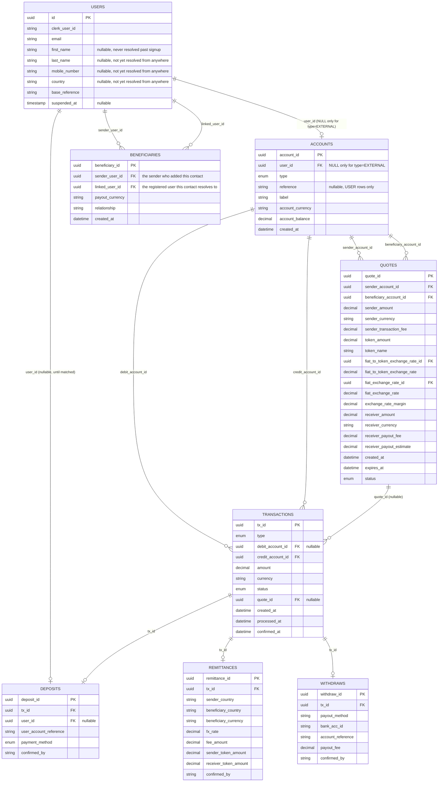

# RemitX — Transaction Model

Cross-border remittance prototype. Sender in South Africa pays ZAR, beneficiary in Zimbabwe receives ZWL, settled with `uctusd` tokens on the XRP Ledger Testnet.

---

## 1. Ledger Model

Every party that can hold money — a real user, or RemitX itself, or an external counterparty — is a row in `accounts`. Every movement of money — a deposit, a fee, a remittance leg, a withdrawal leg, a treasury top-up — is a row in `transactions`, debiting one account and crediting another. There is no separate `transfers`/`balances` split: `accounts` carries the current balance directly, `transactions` is the append-only history that produced it.

```sql
CREATE TABLE accounts (
    account_id       UUID PRIMARY KEY,
    user_id          UUID REFERENCES users(id),   -- NULL only for type='EXTERNAL'
    type             VARCHAR(24) NOT NULL,          -- USER, REMITX_FIAT, REMITX_XRPL_WALLET,
                                                     -- REMITX_REVENUE, EXTERNAL
    reference        TEXT UNIQUE,                   -- e.g. "sian1-zar" — USER rows only
    label            TEXT NOT NULL,                 -- "sian1-zar (ZAR)", "RemitX SA Bank Account",
                                                     -- "RemitX XRPL Treasury Wallet", "RemitX SA Fee Revenue",
                                                     -- "UCTUSD Issuer (Exchange)"
    account_currency VARCHAR(8) NOT NULL,
    account_balance  NUMERIC(20,8) NOT NULL DEFAULT 0,
    created_at       TIMESTAMPTZ NOT NULL DEFAULT NOW(),

    CONSTRAINT ck_account_owner CHECK (
        (type <> 'EXTERNAL' AND user_id IS NOT NULL) OR (type = 'EXTERNAL' AND user_id IS NULL)
    ),
    CONSTRAINT ck_account_reference CHECK (
        (type = 'USER' AND reference IS NOT NULL) OR (type <> 'USER' AND reference IS NULL)
    ),
    CONSTRAINT ck_account_balance_nonneg CHECK (
        type <> 'USER' OR account_balance >= 0
    )
);
-- One row per (user_id, account_currency): a user with both ZAR and uctusd
-- activity has two account rows, not one multi-currency row.
CREATE UNIQUE INDEX ON accounts (user_id, account_currency) WHERE type = 'USER';
```

A `USER` account's `account_id` is its own independently-generated id — **not** the same value as `user_id`. `accounts.user_id` is a plain nullable FK, same shape as `Deposit.user_id` elsewhere in this codebase: for a `USER` row, the real customer it belongs to; for every RemitX-owned platform row (`RemitX SA Bank Account`, `RemitX XRPL Treasury Wallet`, `RemitX SA Fee Revenue`, …), the admin who administers it — admins are `User` rows too, hand-seeded together with these accounts by `scripts/seed_platform_accounts.py`. `NULL` only for a genuinely `EXTERNAL` row: `UCTUSD Issuer (Exchange)`, the issuing address the lecturer pre-funds the Treasury Wallet from and every withdrawal burns back to (§2, Phase E) — no RemitX admin owns it.

RemitX keeps one real `REMITX_FIAT` bank account, and a matching `REMITX_REVENUE` fee account in the same currency, per country it settles fiat in — a fee earned on a ZAR transaction can no more land in a USD revenue account than a ZAR deposit could land in the USD bank account. Currently seeded (`scripts/seed_platform_accounts.py`): `RemitX SA Bank Account` / `RemitX SA Fee Revenue` (ZAR), `RemitX US Bank Account` / `RemitX US Fee Revenue` (USD), `RemitX ZIM Bank Account` / `RemitX ZIM Fee Revenue` (ZWL), `RemitX NAM Bank Account` / `RemitX NAM Fee Revenue` (NAD) — plus the single `RemitX XRPL Treasury Wallet` (`uctusd`) and `UCTUSD Issuer (Exchange)` (`uctusd`), neither of which is per-country.

```sql
CREATE TABLE transactions (
    tx_id             UUID PRIMARY KEY,
    type              VARCHAR(24) NOT NULL,   -- deposit, treasury_funding, remittance, fee, withdrawal
    debit_account_id  UUID REFERENCES accounts(account_id),            -- destination; NULL while pending and unattributed
    credit_account_id UUID NOT NULL REFERENCES accounts(account_id),   -- source
    amount            NUMERIC(20,8) NOT NULL,   -- always positive
    currency          VARCHAR(8) NOT NULL,
    status            VARCHAR(16) NOT NULL,     -- pending, confirmed, failed
    quote_id          UUID REFERENCES quotes(quote_id),   -- nullable; shared across every leg of one quote
    created_at        TIMESTAMPTZ NOT NULL DEFAULT NOW(),
    processed_at      TIMESTAMPTZ,
    confirmed_at      TIMESTAMPTZ
);
```

**`credit` = source, `debit` = destination** — money always flows credit → debit. A `confirmed` row is append-only: a mistake or a failure already settled is corrected with a new row, never an `UPDATE` to its accounts or amount (see Write Rules, §3). A `pending` row hasn't settled anything yet, so it's fair game to fill in — e.g. a deposit's `debit_account_id` starting `NULL` and getting set once the destination is known (§2, Phase A).

**`account_balance` only ever changes as part of a guarded status transition**, never at plain insert time: `UPDATE transactions SET status='confirmed' WHERE tx_id=? AND status='pending'`, with the matching `accounts.account_balance` delta applied in the *same* commit. A row that's certain the moment it's written (a matched deposit — see §2, Phase A) is simply inserted straight as `'confirmed'` — insert-then-immediately-confirm, one commit, no real waiting. A row that's part of something whose overall outcome is still uncertain — every leg of a remittance, since the whole thing can still fail at settlement, not just its final hop — is inserted `'pending'` and stays that way until the outcome is known. When several rows need to resolve together, the guard widens from one `tx_id` to every row sharing a `quote_id`: `UPDATE transactions SET status='confirmed' WHERE quote_id=? AND status='pending'` (see §2, Phase C) — same idempotence, just applied to a group instead of a single row. This is the same guarded-update pattern already used by `remitx_worker/tasks.py::process_integration_message`, just widened.

**Non-negative balances are enforced twice** for `USER` accounts: an application-level check (`account_balance >= amount`, before writing any `transactions` row that would make this account the source, i.e. its `credit_account_id`) gives a clean "insufficient balance" error; the `ck_account_balance_nonneg` CHECK above is the backstop that turns a bug in that check into a hard rollback instead of silent corruption. Platform/external accounts are deliberately exempt — a treasury account may legitimately need to run negative internally.

**Currency consistency is enforced in code, not the database**: whatever writes a `transactions` row must itself verify `transactions.currency == debit_account.account_currency == credit_account.account_currency` — Postgres can't `CHECK` across two other tables' columns. Practical consequence: an FX conversion is always two `transactions` rows through an intermediary account (see Phase B below), never one row that changes currency mid-flight.

### XRPL accounts and the `uctusd` / RLUSD relationship

Two XRPL Testnet accounts sit behind two `accounts` rows:

| Account | Role |
|---|---|
| `OPERATIONAL` (RemitX XRPL Treasury Wallet, `REMITX_XRPL_WALLET`) | The platform's own custodial wallet. Holds `uctusd` on RemitX's behalf. |
| `ISSUER` (`UCTUSD Issuer (Exchange)`, `EXTERNAL`) | The issuing address (`rELez4x4Zqv3KYqboYVfrYPF8521Ycbxa5`, `.env.example`'s `UCTUSD_ISSUER`). Per the course's clarifications: this is also the "exchange" — sending tokens here *is* handing them over, no separate mock exchange integration needed. |

`uctusd` stands in for RLUSD. The brief allows a "lecturer-approved test-token transfer" in place of RLUSD itself — the real Testnet RLUSD faucet is rate-limited, so the course issues `uctusd` instead (`.env.example` carries the same rationale next to `UCTUSD_ISSUER`). Everywhere this doc says `uctusd`, read it as RLUSD's stand-in.

`uctusd` is an issued currency, not XRP — an account can't hold it without a TrustLine to the issuer. `OPERATIONAL` holds exactly one: a `TrustSet` to `ISSUER`, opened once at wallet setup (`platform_wallet/scripts/create_xprl_platform_wallet.py`'s `create_trust_line` / `trust_line_exists`). Its absence is exactly what the `tecNO_LINE` failure code (§2, Phase E) means.

**Settled, per the course's clarifications (10 Sep):** the withdrawal burn — a `Payment(OPERATIONAL → ISSUER)` — is the *only* leg in the whole system that touches the XRPL chain. Remittance settlement (crediting a beneficiary, §2 Phase C) is pure database bookkeeping: the Treasury Wallet is pre-funded already, so crediting someone from it never needs a chain call. There's no "buying" or minting step to simulate either — the Treasury Wallet's starting `uctusd` balance is recorded once, as a real `treasury_funding` transaction crediting it from `ISSUER`, reflecting the actual on-chain balance the lecturer funded (`scripts/seed_platform_accounts.py` queries it directly from the testnet) — not a per-remittance event.

---

## 2. The Flow

Assumes both parties are registered and KYC-approved (`KycApplicationRepository.get_standing` is what answers that). Sender tops up a ZAR balance, then sends from it — deposits and remittances are independent, so one top-up can fund several sends.

### Phase A — Sender deposits ZAR

Every user is issued a `User.base_reference` at signup — first name, lowercased and capped at 8 characters, plus a disambiguating number, e.g. Sipho's `sipho1`. It's never itself an EFT reference; instead, both of the user's accounts (created together, eagerly, in the same transaction as signup) get their own `accounts.reference` by appending a currency suffix to it — Sipho's ZAR account is `sipho1-zar`, his `uctusd` account `sipho1-tok`. It's the `-zar` one he quotes on every EFT, for life; the `-tok` one is never depositable into directly (bank-statement matching is always scoped to ZAR — see A2).

**A1. Sender pays** *(off platform)* — EFT into RemitX SA's bank account, reference = the sender's ZAR account reference (`sipho1-zar`). Nothing in the platform's database changes yet.

**A2. Admin reconciles** *(daily, against the RemitX SA bank statement — simulated, admin pushes a "Process Deposits" button on the admin portal)*. For the sake of this project, cash-in reconciliation is simulated and executed via that admin button rather than genuinely reading a live bank feed — in reality this would be a daily cron job that runs `process_deposits` on a schedule, with the button standing in for it, same as Phase E's withdrawal batch-processing. Every statement line gets a `deposits` row **and** a `transactions` row immediately, whether or not it matches — the arrival is a fact either way, only its destination might be uncertain. Matching looks up an `accounts` row by reference, scoped to ZAR — never any of the user's other currency accounts:

- **Match** → `transactions`: credit `RemitX SA Bank Account`, debit **Sipho's ZAR account**, type `deposit`, **confirmed**, amount 1000.00. `deposits` → new row, `tx_id` set, `user_id` set, `confirmed_by = 'system'`.
- **No match** → `transactions`: credit `RemitX SA Bank Account`, `debit_account_id` **NULL**, type `deposit`, **pending**, amount 1000.00 — the source of the money is known, the destination isn't, yet. `deposits` → new row, `tx_id` set (this same row), `user_id` **NULL**, `confirmed_by` NULL.

**A3. Admin resolves an unmatched deposit** *(manual, from the admin portal, reviewing the sender's proof of payment)*. This **updates that same `transactions` row** — guarded `UPDATE transactions SET debit_account_id = <Sipho's ZAR account>, status = 'confirmed' WHERE tx_id = ? AND status = 'pending'`, in the same commit as increasing Sipho's `account_balance`. `deposits.user_id` and `confirmed_by` (the admin's id) get set at the same time. Nothing about this is a mutation of settled history — the row hadn't posted anything while it was `pending`, so filling in its destination now doesn't erase a fact the way editing a `confirmed` row would.

Sender's ZAR balance is 1,000. Nothing on chain. No tokens exist yet.

### Phase B — Sender pays the beneficiary (remittance)

**B1. Request a quote** — `quotes`: sender's ZAR account, beneficiary's `uctusd` account (exists from signup — see §2, Phase A), mid rate 18.50, fee 20.00, margin 10.00, net 970.00, settlement **52.432432 uctusd**, `ACTIVE`, expires in 15 min.

**B2. Sender confirms** — one commit, inserting a `remittances` row (`remittance_id`, `sender_country`, `beneficiary_country`, `beneficiary_currency`, `fx_rate`, `fee_amount`, `sender_token_amount`, `receiver_token_amount`, `confirmed_by`) and every leg it needs — **all four inserted `pending`**, sharing one `quote_id`, and none of them touching a balance yet:

- `transactions` → credit Sipho's ZAR account, debit `RemitX SA Fee Revenue`, amount 30.00, type `fee`, **pending**
- `transactions` → credit Sipho's ZAR account, debit `RemitX SA Bank Account`, amount 970.00, type `remittance`, **pending**
- `transactions` → credit `RemitX XRPL Treasury Wallet`, debit **Sipho's `uctusd` account**, amount 52.432432, type `remittance`, **pending**
- `transactions` → credit **Sipho's `uctusd` account**, debit **Tendai's `uctusd` account**, amount 52.432432, type `remittance`, **pending** — this is the row `remittances.tx_id` (`NOT NULL`) points at
- `quotes` → **USED** (not yet implemented — see §8 #11)

Sipho's `uctusd` account nets to exactly zero across the two token legs, once they confirm — it's a momentary pass-through that exists so the sender's own activity history shows the tokens they sent, not a balance they ever actually held.

**Nothing about this remittance is final yet — not even the fee.** No account's `account_balance` moves at B2; every one of these four rows is still waiting on Phase C. See §8 for the balance-check consequence this has (Sipho's ZAR balance hasn't actually dropped yet, so what stops a second remittance from being confirmed against the same, still-intact funds while this one is in flight).

Then, only after that commit returns, `queue_service.enqueue_settle_remittance(remittance_id)` enqueues the Celery task `remitx_worker.tasks.settle_remittance` onto the Redis-backed `settlement` queue.

### Phase C — Settlement

**C1. Worker consumes.** Loads the `remittances` row, and the `transactions` row its `tx_id` points at (still `pending`).

**C2. Resolve.** Nothing to submit anywhere — crediting a beneficiary only ever moves value the Treasury Wallet already holds (§1), so this step is a guaranteed-success guarded batch-confirm, not an XRPL call. (Contrast Phase E, the only phase that actually submits anything to the chain.)

**C3. Confirmed** — a single guarded update flips **all four** legs together, since they share one `quote_id`: `UPDATE transactions SET status='confirmed', confirmed_at=? WHERE quote_id=? AND status='pending'`, in the same commit as increasing `account_balance` on whichever account is each row's destination — `RemitX SA Fee Revenue` +30.00, `RemitX SA Bank Account` +970.00, Sipho's `uctusd` account +52.432432, Tendai's `uctusd` account +52.432432 (Sipho's nets back to zero once his own next line, the sender→beneficiary leg, applies). Still idempotent the same way as a single-row guard: a redelivered message finds nothing left `pending` for that `quote_id` and does nothing. Barring a DB-level fault, this step can't meaningfully fail — see §2 Phase E for where a real failure can actually occur.

### Phase D — Beneficiary sees funds

`GET /wallet` reads Tendai's `uctusd` `accounts.account_balance` directly → 52.432432 `uctusd`.

### Phase E — Beneficiary withdraws ZWL

No manual admin-approval gate — holding a customer's own money hostage behind a human clicking a button isn't something this design does. A withdrawal is persisted the moment it's requested; an admin-triggered batch action settles every pending one, mirroring how Phase A's reconciliation already simulates a daily cron via a button.

**E1. Beneficiary requests a withdrawal** *(customer-facing, immediate)*. One commit: a `withdraws` row (`payout_method`, `bank_acc_id`, `payout_reference`, `payout_fee`, `confirmed_by`) plus two legs — unlike Phase B, they don't share the same fate, because only one of them depends on anything uncertain:

- `transactions` → credit Tendai's `uctusd` account, debit `RemitX XRPL Treasury Wallet`, amount 52.432432, type `withdrawal`, **confirmed immediately** — fully deterministic, no external dependency, so it locks in right away. Tendai's `uctusd` `account_balance` **−52.432432** the moment this commits, which is what stops the same funds being withdrawn twice while the actual burn is still in flight.
- `transactions` → credit `RemitX XRPL Treasury Wallet`, debit `UCTUSD Issuer (Exchange)`, amount 52.432432, type `withdrawal`, **pending** — the row `withdraws.tx_id` (`NOT NULL`) points at. The Treasury Wallet nets back to zero once this confirms (same pass-through role Sipho's `uctusd` account plays in Phase B).

**E2. Admin batch-processes** *(simulated cron via an admin-portal "Process Withdrawals" action, same pattern as `process_deposits`)*. For every still-`pending` withdrawal transaction, `queue_service.enqueue_redeem_tokens(withdraw_id)` enqueues `remitx_worker.tasks.redeem_tokens` on the settlement queue. The worker submits the real burn: `Payment(RemitX XRPL Treasury Wallet → UCTUSD Issuer (Exchange))` — per the course's clarifications, sending tokens to the issuing address *is* handing them to the exchange; no separate exchange integration is simulated.

**E3. Confirmed** — guarded single-row transition on the pending leg (`WHERE tx_id=? AND status='pending'`), in the same commit as increasing `UCTUSD Issuer (Exchange)`'s `account_balance` **+52.432432**. Tokens have now genuinely left the system.

**On failure** (`tecNO_LINE`, `tecPATH_DRY`, `tefMAX_LEDGER`): the pending leg → `failed`, and a new reversing `transactions` row restores Tendai's balance (credit `RemitX XRPL Treasury Wallet`, debit Tendai's `uctusd` account, amount 52.432432) — a real reversal is needed here, unlike Phase C, because Tendai's debit already confirmed and moved a real balance in E1.

**E4. Payout** *(off platform, mock)* — `transactions` → credit `RemitX ZIM Bank Account`, debit `EXTERNAL_PAYOUT`, amount 1,324.24, type `withdrawal`, confirmed. Funded by the rands from Phase A.

---

## 3. Database Tables



```sql
CREATE TABLE deposits (
    deposit_id             UUID PRIMARY KEY,
    tx_id                  UUID NOT NULL REFERENCES transactions(tx_id),
    user_id                UUID REFERENCES users(id),   -- NULL until matched
    user_account_reference TEXT,                          -- raw reference string from the bank statement
    payment_method         VARCHAR(16) NOT NULL,          -- cash, bank_transfer, card
    confirmed_by           TEXT                           -- admin id, or 'system' if matched at import
);

CREATE TABLE remittances (
    remittance_id         UUID PRIMARY KEY,
    tx_id                 UUID NOT NULL REFERENCES transactions(tx_id),
    sender_country        TEXT NOT NULL,
    beneficiary_country   TEXT NOT NULL,
    beneficiary_currency  VARCHAR(8) NOT NULL,
    fx_rate               NUMERIC(20,8) NOT NULL,
    fee_amount            NUMERIC(20,8) NOT NULL,
    sender_token_amount   NUMERIC(20,8) NOT NULL,
    receiver_token_amount NUMERIC(20,8) NOT NULL,
    confirmed_by          TEXT
);

CREATE TABLE withdraws (
    withdraw_id      UUID PRIMARY KEY,
    tx_id            UUID NOT NULL REFERENCES transactions(tx_id),
    payout_method    TEXT NOT NULL,
    bank_acc_id      TEXT NOT NULL,
    payout_reference TEXT,
    payout_fee       NUMERIC(20,8) NOT NULL,
    confirmed_by     TEXT
);

-- A sender's beneficiary contact. first_name/last_name/email/mobile_number/
-- country are deliberately NOT columns here — a beneficiary must already be
-- a registered user, so those are read from `users` via a join wherever a
-- beneficiary is displayed, rather than duplicated and risking staleness if
-- that user later updates their own details.
CREATE TABLE beneficiaries (
    beneficiary_id   UUID PRIMARY KEY,
    sender_user_id   UUID NOT NULL REFERENCES users(id),   -- the sender who added this contact
    linked_user_id   UUID NOT NULL REFERENCES users(id),   -- the registered user this contact resolves to
    payout_currency  VARCHAR(8) NOT NULL,                  -- USD, ZWL, or NAD
    relationship     VARCHAR(16) NOT NULL,                 -- partner, parent, child, sibling, relative, friend, employee, other
    created_at       TIMESTAMPTZ NOT NULL DEFAULT NOW()
);

CREATE TABLE quotes (
    quote_id               UUID PRIMARY KEY,
    sender_account_id      UUID NOT NULL REFERENCES accounts(account_id),
    beneficiary_account_id UUID NOT NULL REFERENCES accounts(account_id),
    sender_amount          NUMERIC(20,8) NOT NULL,
    sender_currency        VARCHAR(8) NOT NULL,
    sender_transaction_fee NUMERIC(20,8) NOT NULL,
    token_amount           NUMERIC(20,8) NOT NULL,
    token_name             VARCHAR(8) NOT NULL,
    -- Required: token units per 1 sender_currency (the inverse of
    -- sender_currency's USD quote — multiply, don't divide, for
    -- token_amount). Id null only for USD (peg needs no lookup).
    fiat_to_token_exchange_rate_id UUID REFERENCES exchange_rates(id),
    fiat_to_token_exchange_rate    NUMERIC(20,8) NOT NULL,
    -- Required: direct sender_currency <-> receiver_payout_currency rate,
    -- always backed by a real ExchangeRate row, even when the two
    -- currencies match. Doesn't feed settlement math.
    fiat_exchange_rate_id  UUID NOT NULL REFERENCES exchange_rates(id),
    fiat_exchange_rate     NUMERIC(20,8) NOT NULL,
    exchange_rate_margin   NUMERIC(20,8) NOT NULL,
    receiver_amount        NUMERIC(20,8) NOT NULL,
    receiver_currency      VARCHAR(8) NOT NULL,
    receiver_payout_fee    NUMERIC(20,8) NOT NULL,
    receiver_payout_estimate NUMERIC(20,8) NOT NULL,
    created_at             TIMESTAMPTZ NOT NULL DEFAULT NOW(),
    expires_at             TIMESTAMPTZ NOT NULL,
    status                 VARCHAR(16) NOT NULL   -- ACTIVE, USED, EXPIRED
);
```

| Table | Purpose |
|---|---|
| `accounts` | Every party that can hold a balance — real users and platform/external parties alike. §1. |
| `transactions` | Every movement of money. The only table with a `status` lifecycle. §1. |
| `deposits` | ZAR cash-in header. One row, one linked `transactions` row, always — an unmatched deposit's `debit_account_id` just starts `NULL` and gets filled in on resolution (§2, Phase A). |
| `remittances` | The send. `tx_id` points at the one leg whose `status` represents whether the whole remittance settled. |
| `withdraws` | Token → fiat. `tx_id` points at the redeem/burn leg the same way. |
| `quotes` | The frozen price shown to the customer, for either a remittance or a withdrawal. Built (§2, Phase B1) — nothing consumes a quote yet, remittance confirmation is a later slice. |
| `beneficiaries` | A sender's contact — who they can quote/remit to. Built. `linked_user_id` must already be a registered `User`; first_name/last_name/email/mobile_number/country are read from that `User` via a join, never duplicated here. A sender adds one by looking up the target's fiat account reference (e.g. `sian1-zar` — the same one they'd quote for an EFT deposit), never the `uctusd` reference or a raw user id — see `BeneficiaryController.lookup_by_fiat_account_reference`. |
| `users` | `base_reference` and `suspended_at`. `base_reference` is not itself an EFT reference — see §1, §2 Phase A. Carries neither a staff flag (RBAC's `user_roles` decides that) nor a KYC status: a user's KYC standing is derived from `kyc_applications`, not copied here. |
| `kyc_applications`, `kyc_documents`, `kyc_decisions` | One row per KYC attempt, its evidence, and the append-only log of reviewer decisions. Outside the money flow, so not drawn above — see remitx_api/models/orm/kyc_lifecycle.py for the status machine. |
| `currencies`, `fee_config` | Deferred — not revisited under this redesign yet. See §8. |
| `exchange_rates` | Built (§2, Phase B1; §4) — a real API-backed rate, fetched lazily. |
| `xrpl_accounts`, `xrpl_settlements` | Not yet reconciled with the new ledger shape. See §8. |
| `audit_log` | Built, but for RBAC/KYC actions, not this ledger — see `models/orm/audit_log.py`. Not drawn above; outside the money flow. |

**Write rules:**

- Every `transactions` insert and its account-balance effect happen in the **same commit**, and balance only ever moves on a guarded status transition (§1) — never at plain insert, never via a later `UPDATE` to a row's accounts or amount.
- A `confirmed` `transactions` row is append-only — nothing about a settled group of legs is later rewritten. A `pending` row hasn't settled anything yet, so filling in a missing detail (an unmatched deposit's `debit_account_id`) or flipping a whole group to `failed` (a remittance that doesn't settle — see §2, Phase C) is not a mutation of history — see §1.
- `remittances`' beneficiary is frozen at creation (via the leg `tx_id` points at, and the `transactions` row's own `debit_account_id` — the beneficiary is the *destination* of that leg) — re-linking a beneficiary elsewhere cannot redirect an old remittance.
- Fees are ordinary `transactions` rows landing in that leg's currency-matched `REMITX_REVENUE` account (`debit_account_id`, since it's always the destination, never the source) — a ZAR fee always lands in `RemitX SA Fee Revenue`, never in another country's revenue account. Revenue for one account is always `SELECT SUM(amount) FROM transactions WHERE debit_account_id = <fee revenue account> AND status = 'confirmed'`; total revenue across countries means summing that per account and converting, since each is a different currency.
- Status changes are guarded updates — `WHERE tx_id=? AND status='pending'` for a single row, or `WHERE quote_id=? AND status='pending'` when several legs need to resolve together (§2, Phase C) — then check rowcount. This is the whole duplicate-payment defense — a redelivered queue message that tries the same transition twice just fails the second `UPDATE`'s row-count check.
- Only the settlement worker decrypts XRPL seeds. Never returned by the API, never logged, never committed to git.
- Reconciliation is an admin-triggered check, not a background job: compare `SUM(amount) WHERE debit_account_id = account_id` minus `SUM(amount) WHERE credit_account_id = account_id`, from `transactions WHERE status='confirmed'`, against `accounts.account_balance`, report the mismatch count back to the admin portal. Not yet built.

---

## 4. Exchange Rates — built, as lazy fetch-on-demand rather than a scheduled job

No `rate_fetcher.py`/APScheduler timer exists or is planned — fetching is triggered by demand, not a clock:

- **`exchange_rate_provider.ExchangeRateApiProvider`** — the `RateProvider` interface (a `Protocol`, not an ABC) behind which the real call lives: `httpx.get` against exchangerate-api.com's pair-conversion endpoint (`EXCHANGE_RATE_API_KEY`, §6). Tests fake this class directly rather than monkeypatching `httpx`.
- **`exchange_rate_service.get_active_rate(base_currency, quote_currency)`** — the single entry point every quote calculation goes through (`quote_service._token_rate`/`_direct_fiat_rate`). Reuses a stored `exchange_rates` row while `valid_until > now`; on expiry, fetches live and `INSERT`s a new row with `valid_until = fetched_at + RATE_FIXING_INTERVAL_HOURS`. If the live fetch itself fails, falls back to the most recent stored row *of any age* as long as it's within `MAX_RATE_STALENESS_HOURS`; past that, raises `RateUnavailableError` — the API refuses to quote rather than use a stale or fabricated price. Raises `UnsupportedCurrencyError` up front for any pair outside `SUPPORTED_CURRENCIES` (`USD`, `ZAR`, `ZWL`, `NAD`).
- `ExchangeRateRepository.get_current_rate`/`get_most_recent_rate` back the two lookups above.

**Two expiries, different jobs:** `exchange_rates.valid_until` = how long a *price* is publishable. `quotes.expires_at` (15 min) = how long a *customer's* price is honoured.

---

## 5. Fees — decided and implemented

| Fee | Rate | Covers |
|---|---|---|
| Fixed remittance | R15 flat, converted into the sender's own currency | Processing overhead — noticeably below Mukuru's ~R89–137 fee range |
| Percentage | 0.5% of sender_amount | Modest, transparent, scales with value, like Wise |
| FX margin | 1.0% over mid-market USD/sender_currency | Real revenue driver — still far below Mukuru's 1.4–3% or Western Union's implied margin |
| Cash-out fee | 0.75% of the beneficiary payout-currency amount redeemed | Covers the fiat liquidity-pool cost flagged as the platform's remaining working-capital need (§7) |

The FX margin is a spread on the mid rate, not a separate line the customer pays. The cash-out fee replaces the earlier flat "1.5 tokens" withdrawal-fee placeholder — it now scales with the amount redeemed, same rationale as the percentage fee. No real cash-out flow exists yet, so `receiver_amount`/`receiver_payout_fee`/`receiver_payout_estimate` on a quote are a display estimate, in the beneficiary's own payout currency (`receiver_currency`, e.g. ZWL — converted directly from the sender's net amount via `fiat_exchange_rate`, not routed through the token leg) of what they'd net if they redeemed today (`models/orm/quote.py`).

**All-in cost on a R1,000 ZAR send: ~2.3%** — roughly 6–7x cheaper than the SA national average (15.65%), competitive with Wise/TransferGo, while still leaving more cost-to-serve headroom than Mukuru/Mama Money.

**Currency-generality (resolves Open Question #8):** `FIXED_FEE_ZAR` is denominated in ZAR. When `sender_currency` isn't ZAR, `quote_service._convert_zar_fee_to_sender_currency` converts it via each currency's own token/USD peg — `FIXED_FEE_ZAR * (token units per ZAR) / (token units per sender_currency)` — reusing the sender leg's already-fetched rate rather than a separate ZAR-quote_currency pair fetch. This makes the fixed fee real for every supported sender currency, not just ZAR.

Implemented in `config.py`'s `Config` class, sourced from `.env`: `FIXED_FEE_ZAR`, `PERCENTAGE_FEE_RATE`, `FX_MARGIN_RATE`, `CASH_OUT_FEE_RATE`.

Also uncertain: whether a separate **token fee** (for minting/burning uctusd
itself, distinct from the remittance fee above and the cash-out fee) will
be charged — see Open Question #9.

---

## 6. Config

Sourced from the root `.env` (`.env.example`), read directly by `Config` (`api/remitx_api/config.py`) and referenced as `Config.<NAME>` from `services/quote_service.py` and `services/exchange_rate_service.py`:

```python
RATE_FIXING_INTERVAL_HOURS = 1
MAX_RATE_STALENESS_HOURS = 26  # refuse to quote past this
QUOTE_TTL_MINUTES = 15

FIXED_FEE_ZAR = 15  # converted into sender_currency when it isn't ZAR — see §5
PERCENTAGE_FEE_RATE = 0.005
FX_MARGIN_RATE = 0.01
CASH_OUT_FEE_RATE = 0.0075

DAILY_LIMIT_ZAR_UNVERIFIED = (
    0  # brief's Unverified tier — rejected outright, not just limited
)
MONTHLY_LIMIT_ZAR_UNVERIFIED = 0
DAILY_LIMIT_ZAR = 3000  # Verified tier
MONTHLY_LIMIT_ZAR = 25000
```

---

## 7. Assumptions and Limitations

- **Stored, materialized balances**, checked on demand rather than continuously. `accounts.account_balance` is updated directly rather than derived by summing `transactions` on every read — faster to query, but a write that touches one without the other would drift silently. Mitigated by one function performing both writes in one transaction; an admin-triggered reconciliation check (§3) catches drift on demand rather than continuously.
- **Omnibus custody.** Customers hold database claims, not XRPL accounts. Sender-to-beneficiary transfers never touch the chain — the only leg in the whole system that does is the withdrawal burn (§1, §2 Phase E).
- **No transactional outbox.** The queue message is published after commit, leaving a small window where a crash loses the message. The guarded status-transition pattern still prevents double-payment even so.
- **Bank-transfer-only cash-in.** ZAR deposits are assumed to arrive by EFT into RemitX's account, ideally carrying the sender's permanent ZAR account reference. Cash and card cash-in are out of scope.
- **One super admin owns every platform account.** `scripts/seed_platform_accounts.py` provisions a single admin (`ADMIN_CLERK_USER_ID`) and sets every non-`EXTERNAL` platform account's `user_id` to that one admin, regardless of country — there's no per-country or per-role admin ownership yet. Fine for this prototype; revisit if platform accounts ever need to be attributed to different admins.
- **Every user defaults to a South African (ZAR) account.** `AccountRepository.create_user_accounts` always builds a ZAR account (plus the `uctusd` settlement account) at signup, regardless of who the user actually is — there's no onboarding step yet where a user picks their own home/default currency. The intended eventual design: a login/signup stage where the user chooses their default currency account, with ZAR-by-default as the fallback only until that step exists. Revisit `create_user_accounts` (and the account-creation flow generally) once that choice step is built.

---

## 8. Open Questions

Deliberately unresolved for now — flagging rather than guessing:

1. ~~Which leg actually touches the XRPL chain, and when.~~ **Resolved, per the course's clarifications (10 Sep).** The withdrawal burn — `Payment(RemitX XRPL Treasury Wallet → UCTUSD Issuer (Exchange))` — is the only on-chain leg in the system (§1, §2 Phase E). Remittance settlement (§2 Phase C) never touches chain: crediting a beneficiary only moves value the Treasury Wallet already holds, and that starting stock is itself a one-time `treasury_funding` transaction recorded from the real, lecturer-funded on-chain balance — not a per-remittance purchase or mint. The message-queue requirement is satisfied regardless: `settle_remittance` stays queued because it's what the brief specifically grades, `redeem_tokens` because it's the one task actually making a network call.
2. ~~A quote can reference a beneficiary or sender account that doesn't exist yet.~~ **Resolved.** Both of a user's accounts are created eagerly at signup (§2, Phase A) — every user already has a `uctusd` account before anyone could ever quote a remittance to them.
3. **Nothing stops a platform/external account being seeded twice.** `scripts/seed_platform_accounts.py` checks `get_platform_account_by_label(label)` before inserting, so re-running the script is safe — but nothing at the schema level stops a second, differently-run script or a manual insert from creating a duplicate. Worth a `UNIQUE (type, label, account_currency) WHERE type <> 'USER'` if that's ever a real risk.
4. ~~Withdrawal request vs. approval.~~ **Resolved.** No approval gate — the customer's request itself creates the `withdraws` row and its pending redeem-leg transaction (§2, Phase E). An admin-triggered batch action settles every pending one, mirroring Phase A's reconciliation-button pattern.
5. ~~A sender's ZAR balance doesn't actually drop until settlement confirms.~~ **Resolved, at quote time.** Since all four of a remittance's legs stay `pending` until Phase C (§2, Phase B), `account_balance` is untouched for the whole in-flight window. `quote_service.create_quote` no longer checks the raw stored balance for this reason — it calls `AccountRepository.get_available_balance`, which nets the sender's raw balance against their own still-`pending` outgoing legs, so a second quote against the same, still-intact raw balance is rejected (`InsufficientBalanceError`). Not fully closed: this check runs at quote creation, not at the (not-yet-built) remittance-confirmation step B2 — a quote issued against an available balance that later gets spent by something else before B2 confirms is still a gap, but the specific double-spend this question named (two quotes/remittances both passing against the same raw balance) is fixed.
6. `currencies`, `fee_config`, `xrpl_accounts`, `xrpl_settlements` haven't been reconciled with this new ledger shape yet — carried over from the earlier design, unchanged, to revisit later. (`exchange_rates` is now built — see §4 — and `audit_log` exists, tracking RBAC/KYC actions rather than the money-flow tables above; neither belongs on this list anymore.)
7. **`process_deposits` has no protection against reprocessing the same bank statement.** Nothing keys on the statement line — no unique constraint, no dedup check — so uploading the same CSV twice (or an overlapping date range), a plausible mistake given it's a manual admin file-picker action, gives every matched line a brand-new `transactions` + `deposits` row and increases the account balance again. No test covers re-running it. Same failure category the brief calls out for the queue ("prevent duplicate messages from crediting more than once"), just hitting the reconciliation step instead — worth fixing (e.g. a unique constraint on the statement line, or hashing it) before calling Phase A done.
8. ~~The fixed remittance fee's amount and currency-generality.~~ **Resolved.** Fee amounts are decided (§5): R15 fixed, 0.5% percentage, 1.0% FX margin, 0.75% cash-out. The fixed fee's currency-generality gap is also closed: it's denominated in ZAR and converted into `sender_currency` via each currency's USD peg at quote time (§5), so the beneficiary-free preview quote (§2 Phase B1) gets a real fixed fee for any supported sender currency, not just ZAR. The FX margin remains a rate *spread* (percentage), which is already currency-general by construction — nothing to convert.
9. **Whether uctusd issuance/burning itself carries a separate token fee.** Today's fee model (§5) only has a remittance-side fee (percentage + FX margin, since #8) and a withdrawal/cash-out fee. Not decided: whether allocating (minting) tokens to a beneficiary at settlement, or burning them at withdrawal, itself carries an additional platform fee distinct from those two. Flagging as a possibility, not deciding either way — would need its own `§5` line and its own field on the relevant transaction/quote model if it's ever added.
10. **Every monetary amount should end up at 2 decimal places, including uctusd — decided, not yet implemented.** Auditing `quote_service.price_remittance` found `fee`/`margin` aren't `.quantize()`d the way `token_amount` already is, so SQLite (tests) and Postgres (prod) could silently disagree on the stored value for the same computation. Chasing that further: the intended fix is 2 decimals everywhere, fiat *and* token — uctusd's current 8-decimal convention isn't an XRPL requirement (IOU amounts on XRPL use up to 15 significant digits with a floating exponent, not a fixed decimal-place cap), it looks borrowed from Bitcoin's satoshi convention, so nothing blocks moving it to 2. Two real obstacles once this is actually done: (a) `accounts.account_balance` and `transactions.amount` are single columns shared by both fiat and token rows (distinguished only by a `currency` string), and their migrations are already applied elsewhere (merged well before this one), so narrowing them from `Numeric(20,8)` needs a real new migration — per this repo's own migration-safety rule, a narrowing change on a live table should go through expand/contract across two releases, not one; (b) `token_amount = net * fiat_to_token_exchange_rate` is a multiplication that rarely lands on a round number, so rounding to 2 decimals sheds more of the fractional remainder than 8 decimals does today — worth being deliberate about when implementing, not just mechanical. A full sweep (every `Numeric(20,8)` column, every `.quantize(...)` call, every 8-decimal-formatted test assertion) hasn't been done yet.
11. **No function yet marks a `Quote` `USED`.** Phase B2/C describe a remittance confirmation flipping the quote's status once its legs are confirmed, but no `remittances` table, confirmation controller, or settlement task exists in code yet (`models/orm/quote.py` only defines `STATUS_ACTIVE`/`STATUS_USED`/`STATUS_EXPIRED`; nothing transitions a row out of `ACTIVE`). Needed: a function that sets a `Quote`'s `status` to `USED` when the remittance referencing its `quote_id` is confirmed/completed — following the same guarded-update pattern already used elsewhere in this codebase (`transaction_repository.confirm_pending_deposit_transaction`, `remitx_worker/tasks.py::process_integration_message`: `UPDATE ... WHERE id=? AND status=<prior>`, idempotent against redelivery).
12. **No quote-receipt lookup exists yet.** There's no endpoint or function that fetches a `Quote` (and the remittance it produced) for a user browsing their transaction history and looking up details on a specific transaction — needed once transaction history itself exists (no `GET /wallet`/transactions listing exists yet either, despite §2 Phase D describing one).

---

## 9. Seeding a Fresh Local Database

A freshly migrated database (`alembic upgrade head`) has a schema and nothing else — no platform accounts, no admin, no XRPL treasury balance recorded. None of this is automated yet; every step below is a manual one-off for local dev.

1. **Migrate the schema.** `cd api && source .venv/bin/activate && alembic upgrade head`.
2. **Set `ADMIN_CLERK_USER_ID`** in `.env` to your own Clerk user id (Clerk dashboard → Users). This is who `scripts/seed_platform_accounts.py` provisions and grants every staff role in the RBAC catalogue (`treasury_operator`, `compliance_officer`, `iam_admin`, …) — sign in with this same Clerk account and the admin portal opens with no manual DB edit needed. Access is decided by those roles' permissions, checked per route by `RequirePermission` (`api/remitx_api/auth/permissions.py`) — there is no staff flag on the `users` row to set.
3. **Run `python scripts/seed_platform_accounts.py`** (from `api/`, venv active, `ADMIN_CLERK_USER_ID` set). Idempotent — safe to re-run. Creates:
   - The admin `User` row (or reuses one that already exists from a prior sign-in), with every `is_admin` role in the catalogue granted to it through `user_roles`.
   - One `REMITX_FIAT` bank account + matching `REMITX_REVENUE` fee account per country (§1) — deposit reconciliation has nowhere to credit money without these.
   - `RemitX XRPL Treasury Wallet` and `UCTUSD Issuer (Exchange)`.
   - If `PLATFORM_WALLET_ADDRESS` is also set and the XRPL testnet is reachable: a one-time `treasury_funding` transaction recording the wallet's real on-chain `uctusd` balance. Skipped with a warning, not a failure, if either is missing.
4. **Sign in via the frontend at least once**, any account (`/sign-in`). First login eagerly creates that user's ZAR + `uctusd` accounts (§2, Phase A) via `ensure_provisioned` — there's no one to deposit against until at least one real user exists this way.
5. **Point a bank-statement CSV at real references.** `api/scripts/sample_bank_statement.csv`'s references (`sian1-zar`, `thabo2-zar`, `amahle1-zar`, …) are placeholders — swap them for the actual `base_reference` of users created in step 4 (`SELECT id, base_reference FROM users;`), or every line lands `pending` instead of matching.
6. **Run the reconciliation job** — via the `/admin/process-deposits` frontend page (needs `cashin:read` to see the queue and `cashin:confirm` to run the job or resolve a line — the `treasury_operator` role carries both), or directly: `deposit_service.process_deposits("scripts/sample_bank_statement.csv")`.
