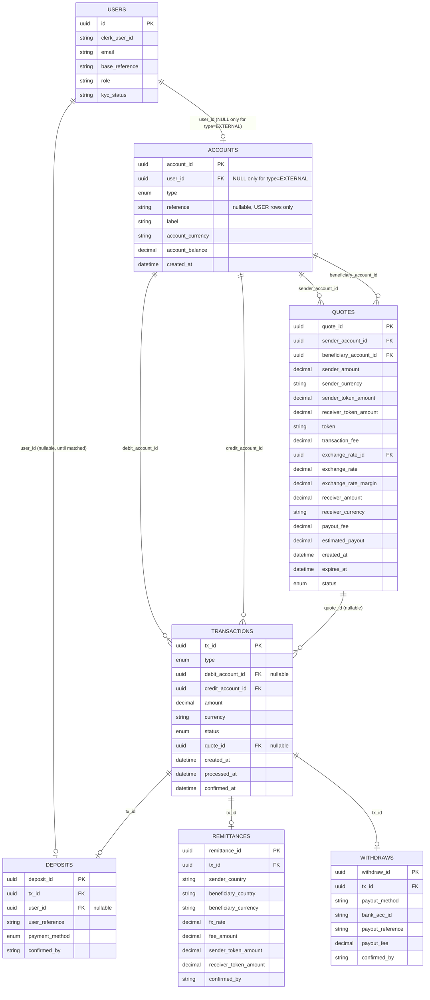

# RemitX — Transaction Model

Cross-border remittance prototype. Sender in South Africa pays ZAR, beneficiary in Zimbabwe receives ZWG, settled with `uctusd` tokens on the XRP Ledger Testnet.

---

## 1. Ledger Model

Every party that can hold money — a real user, or RemitX itself, or an external counterparty — is a row in `accounts`. Every movement of money — a deposit, a fee, a remittance leg, a withdrawal leg, a treasury top-up — is a row in `transactions`, debiting one account and crediting another. There is no separate `transfers`/`balances` split: `accounts` carries the current balance directly, `transactions` is the append-only history that produced it.

```sql
CREATE TABLE accounts (
    account_id       UUID PRIMARY KEY,
    user_id          UUID REFERENCES users(id),   -- NULL only for type='EXTERNAL'
    type             VARCHAR(24) NOT NULL,          -- USER, PLATFORM_FIAT, XRPL_WALLET,
                                                     -- PLATFORM_REVENUE, EXTERNAL
    reference        TEXT UNIQUE,                   -- e.g. "sian1-zar" — USER rows only
    label            TEXT NOT NULL,                 -- "sian1-zar (ZAR)", "RemitX SA Bank Account",
                                                     -- "RemitX Treasury Wallet", "RemitX Fee Revenue", "Kraken"
    account_currency VARCHAR(8) NOT NULL,
    account_balance  NUMERIC(20,8) NOT NULL DEFAULT 0,
    created_at       TIMESTAMPTZ NOT NULL DEFAULT NOW(),

    CONSTRAINT ck_account_owner CHECK (
        (type <> 'EXTERNAL' AND user_id IS NOT NULL) OR (type = 'EXTERNAL' AND user_id IS NULL)
    ),
    CONSTRAINT ck_account_reference CHECK (
        (type = 'USER' AND reference IS NOT NULL) OR (type <> 'USER' AND reference IS NULL)
    ),
    CONSTRAINT ck_account_balance_nonneg CHECK (
        type <> 'USER' OR account_balance >= 0
    )
);
-- One row per (user_id, account_currency): a user with both ZAR and uctusd
-- activity has two account rows, not one multi-currency row.
CREATE UNIQUE INDEX ON accounts (user_id, account_currency) WHERE type = 'USER';
```

A `USER` account's `account_id` is its own independently-generated id — **not** the same value as `user_id`. `accounts.user_id` is a plain nullable FK, same shape as `Deposit.user_id` elsewhere in this codebase: for a `USER` row, the real customer it belongs to; for every RemitX-owned platform row (`RemitX SA Bank Account`, `RemitX Treasury Wallet`, `RemitX Fee Revenue`), the admin who administers it — admins are `User` rows too, hand-seeded together with these accounts by `scripts/seed_platform_accounts.py`. `NULL` only for a genuinely `EXTERNAL` row (`Kraken`, …): no RemitX admin owns a third party's account.

```sql
CREATE TABLE transactions (
    tx_id             UUID PRIMARY KEY,
    type              VARCHAR(24) NOT NULL,   -- deposit, treasury_purchase, remittance, fee, withdrawal
    debit_account_id  UUID REFERENCES accounts(account_id),            -- destination; NULL while pending and unattributed
    credit_account_id UUID NOT NULL REFERENCES accounts(account_id),   -- source
    amount            NUMERIC(20,8) NOT NULL,   -- always positive
    currency          VARCHAR(8) NOT NULL,
    status            VARCHAR(16) NOT NULL,     -- pending, confirmed, failed
    quote_id          UUID REFERENCES quotes(quote_id),   -- nullable; shared across every leg of one quote
    created_at        TIMESTAMPTZ NOT NULL DEFAULT NOW(),
    processed_at      TIMESTAMPTZ,
    confirmed_at      TIMESTAMPTZ
);
```

**`credit` = source, `debit` = destination** — money always flows credit → debit. A `confirmed` row is append-only: a mistake or a failure already settled is corrected with a new row, never an `UPDATE` to its accounts or amount (see Write Rules, §3). A `pending` row hasn't settled anything yet, so it's fair game to fill in — e.g. a deposit's `debit_account_id` starting `NULL` and getting set once the destination is known (§2, Phase A).

**`account_balance` only ever changes as part of a guarded status transition**, never at plain insert time: `UPDATE transactions SET status='confirmed' WHERE tx_id=? AND status='pending'`, with the matching `accounts.account_balance` delta applied in the *same* commit. A row that's certain the moment it's written (a matched deposit — see §2, Phase A) is simply inserted straight as `'confirmed'` — insert-then-immediately-confirm, one commit, no real waiting. A row that's part of something whose overall outcome is still uncertain — every leg of a remittance, since the whole thing can still fail at settlement, not just its final hop — is inserted `'pending'` and stays that way until the outcome is known. When several rows need to resolve together, the guard widens from one `tx_id` to every row sharing a `quote_id`: `UPDATE transactions SET status='confirmed' WHERE quote_id=? AND status='pending'` (see §2, Phase C) — same idempotence, just applied to a group instead of a single row. This is the same guarded-update pattern already used by `remitx_worker/tasks.py::process_integration_message`, just widened.

**Non-negative balances are enforced twice** for `USER` accounts: an application-level check (`account_balance >= amount`, before writing any `transactions` row that would make this account the source, i.e. its `credit_account_id`) gives a clean "insufficient balance" error; the `ck_account_balance_nonneg` CHECK above is the backstop that turns a bug in that check into a hard rollback instead of silent corruption. Platform/external accounts are deliberately exempt — a treasury account may legitimately need to run negative internally.

**Currency consistency is enforced in code, not the database**: whatever writes a `transactions` row must itself verify `transactions.currency == debit_account.account_currency == credit_account.account_currency` — Postgres can't `CHECK` across two other tables' columns. Practical consequence: an FX conversion is always two `transactions` rows through an intermediary account (see Phase B below), never one row that changes currency mid-flight.

### XRPL accounts and the `uctusd` / RLUSD relationship

Two XRPL Testnet accounts sit behind the `XRPL_WALLET`-type row(s) in `accounts`:

| Account | Role |
|---|---|
| `OPERATIONAL` (RemitX Treasury Wallet) | The platform's own custodial wallet. Holds `uctusd` on RemitX's behalf. |
| `ISSUER` | External party. The counterparty whose obligation `uctusd` represents. |

`uctusd` stands in for RLUSD. The brief allows a "lecturer-approved test-token transfer" in place of RLUSD itself — the real Testnet RLUSD faucet is rate-limited, so the course issues `uctusd` instead (`.env.example` carries the same rationale next to `UCTUSD_ISSUER`). Everywhere this doc says `uctusd`, read it as RLUSD's stand-in.

`uctusd` is an issued currency, not XRP — an account can't hold it without a TrustLine to the issuer. `OPERATIONAL` holds exactly one: a `TrustSet` to `ISSUER`, opened once at wallet setup (`platform_wallet/scripts/create_xprl_platform_wallet.py`'s `create_trust_line` / `trust_line_exists`). Its absence is exactly what the `tecNO_LINE` failure code (§2, Phase C) means.

> **Still open — see §9:** exactly which leg of a remittance/withdrawal is the one that actually touches the XRPL chain, and whether that happens per-remittance or as a decoupled treasury top-up, is not yet decided. The ledger mechanics below (which accounts move, in which order) are settled regardless of how that question resolves.

---

## 2. The Flow

Assumes both parties are registered and KYC-approved. Sender tops up a ZAR balance, then sends from it — deposits and remittances are independent, so one top-up can fund several sends.

### Phase A — Sender deposits ZAR

Every user is issued a `User.base_reference` at signup — first name, lowercased and capped at 8 characters, plus a disambiguating number, e.g. Sipho's `sipho1`. It's never itself an EFT reference; instead, both of the user's accounts (created together, eagerly, in the same transaction as signup) get their own `accounts.reference` by appending a currency suffix to it — Sipho's ZAR account is `sipho1-zar`, his `uctusd` account `sipho1-tok`. It's the `-zar` one he quotes on every EFT, for life; the `-tok` one is never depositable into directly (bank-statement matching is always scoped to ZAR — see A2).

**A1. Sender pays** *(off platform)* — EFT into RemitX SA's bank account, reference = the sender's ZAR account reference (`sipho1-zar`). Nothing in the platform's database changes yet.

**A2. Admin reconciles** *(daily, against the RemitX SA bank statement — simulated, admin pushes a button on the admin portal)*. Every statement line gets a `deposits` row **and** a `transactions` row immediately, whether or not it matches — the arrival is a fact either way, only its destination might be uncertain. Matching looks up an `accounts` row by reference, scoped to ZAR — never any of the user's other currency accounts:

- **Match** → `transactions`: credit `RemitX SA Bank Account`, debit **Sipho's ZAR account**, type `deposit`, **confirmed**, amount 1000.00. `deposits` → new row, `tx_id` set, `user_id` set, `confirmed_by = 'system'`.
- **No match** → `transactions`: credit `RemitX SA Bank Account`, `debit_account_id` **NULL**, type `deposit`, **pending**, amount 1000.00 — the source of the money is known, the destination isn't, yet. `deposits` → new row, `tx_id` set (this same row), `user_id` **NULL**, `confirmed_by` NULL.

**A3. Admin resolves an unmatched deposit** *(manual, from the admin portal, reviewing the sender's proof of payment)*. This **updates that same `transactions` row** — guarded `UPDATE transactions SET debit_account_id = <Sipho's ZAR account>, status = 'confirmed' WHERE tx_id = ? AND status = 'pending'`, in the same commit as increasing Sipho's `account_balance`. `deposits.user_id` and `confirmed_by` (the admin's id) get set at the same time. Nothing about this is a mutation of settled history — the row hadn't posted anything while it was `pending`, so filling in its destination now doesn't erase a fact the way editing a `confirmed` row would.

Sender's ZAR balance is 1,000. Nothing on chain. No tokens exist yet.

### Phase B — Sender pays the beneficiary (remittance)

**B1. Request a quote** — `quotes`: sender's ZAR account, beneficiary's `uctusd` account (exists from signup — see §2, Phase A), mid rate 18.50, fee 20.00, margin 10.00, net 970.00, settlement **52.432432 uctusd**, `ACTIVE`, expires in 15 min.

**B2. Sender confirms** — one commit, inserting a `remittances` row (`remittance_id`, `sender_country`, `beneficiary_country`, `beneficiary_currency`, `fx_rate`, `fee_amount`, `sender_token_amount`, `receiver_token_amount`, `confirmed_by`) and every leg it needs — **all four inserted `pending`**, sharing one `quote_id`, and none of them touching a balance yet:

- `transactions` → credit Sipho's ZAR account, debit `RemitX Fee Revenue`, amount 30.00, type `fee`, **pending**
- `transactions` → credit Sipho's ZAR account, debit `RemitX SA Bank Account`, amount 970.00, type `remittance`, **pending**
- `transactions` → credit `RemitX Treasury Wallet`, debit **Sipho's `uctusd` account**, amount 52.432432, type `remittance`, **pending**
- `transactions` → credit **Sipho's `uctusd` account**, debit **Tendai's `uctusd` account**, amount 52.432432, type `remittance`, **pending** — this is the row `remittances.tx_id` (`NOT NULL`) points at
- `quotes` → **CONSUMED**

Sipho's `uctusd` account nets to exactly zero across the two token legs, once they confirm — it's a momentary pass-through that exists so the sender's own activity history shows the tokens they sent, not a balance they ever actually held.

**Nothing about this remittance is final yet — not even the fee.** No account's `account_balance` moves at B2; every one of these four rows is still waiting on Phase C. See §9 for the balance-check consequence this has (Sipho's ZAR balance hasn't actually dropped yet, so what stops a second remittance from being confirmed against the same, still-intact funds while this one is in flight).

Then, only after that commit returns, `queue_service.enqueue_settle_remittance(remittance_id)` enqueues the Celery task `remitx_worker.tasks.settle_remittance` onto the Redis-backed `settlement` queue.

### Phase C — Settlement

**C1. Worker consumes.** Loads the `remittances` row, and the `transactions` row its `tx_id` points at (still `pending`).

**C2. Resolve.** Whatever this leg's outcome actually depends on (§9) is checked/submitted here.

**C3. Confirmed** — a single guarded update flips **all four** legs together, since they share one `quote_id`: `UPDATE transactions SET status='confirmed', confirmed_at=? WHERE quote_id=? AND status='pending'`, in the same commit as increasing `account_balance` on whichever account is each row's destination — `RemitX Fee Revenue` +30.00, `RemitX SA Bank Account` +970.00, Sipho's `uctusd` account +52.432432, Tendai's `uctusd` account +52.432432 (Sipho's nets back to zero once his own next line, the sender→beneficiary leg, applies). Still idempotent the same way as a single-row guard: a redelivered message finds nothing left `pending` for that `quote_id` and does nothing.

**On failure** (`tecNO_LINE`, `tecPATH_DRY`, `tefMAX_LEDGER`, or whatever the real failure surface turns out to be per §9): the same batched update, but to `failed` instead — `UPDATE transactions SET status='failed' WHERE quote_id=? AND status='pending'`. **No reversing transactions needed at all** — nothing was ever confirmed, so nothing ever touched a balance to begin with.

### Phase D — Beneficiary sees funds

`GET /wallet` reads Tendai's `uctusd` `accounts.account_balance` directly → 52.432432 `uctusd`.

### Phase E — Beneficiary withdraws ZWG

No manual admin-approval gate — holding a customer's own money hostage behind a human clicking a button isn't something this design does. A withdrawal is persisted the moment it's requested; an admin-triggered batch action settles every pending one, mirroring how Phase A's reconciliation already simulates a daily cron via a button.

**E1. Beneficiary requests a withdrawal** *(customer-facing, immediate)*. One commit: a `withdraws` row (`payout_method`, `bank_acc_id`, `payout_reference`, `payout_fee`, `confirmed_by`) plus:

- `transactions` → credit Tendai's `uctusd` account, debit `RemitX Treasury Wallet`, amount 52.432432, type `withdrawal`, **pending** — the row `withdraws.tx_id` (`NOT NULL`) points at.

**E2. Admin batch-processes** *(simulated cron via an admin-portal "Process Withdrawals" action, same pattern as `process_deposits`)*. For every still-`pending` withdrawal transaction, `queue_service.enqueue_redeem_tokens(withdraw_id)` enqueues `remitx_worker.tasks.redeem_tokens` on the settlement queue.

**E3. Confirmed** — same guarded transition as Phase C. Tendai's `uctusd` `account_balance` **−52.432432**.

**E4. Payout** *(off platform, mock)* — `transactions` → credit `RemitXZIM Bank Account`, debit `EXTERNAL_PAYOUT`, amount 1,324.24, type `withdrawal`, confirmed. Funded by the rands from Phase A.

---

## 3. Database Tables



```sql
CREATE TABLE deposits (
    deposit_id     UUID PRIMARY KEY,
    tx_id          UUID NOT NULL REFERENCES transactions(tx_id),
    user_id        UUID REFERENCES users(id),   -- NULL until matched
    user_reference TEXT,                          -- raw reference string from the bank statement
    payment_method VARCHAR(16) NOT NULL,          -- cash, bank_transfer, card
    confirmed_by   TEXT                           -- admin id, or 'system' if matched at import
);

CREATE TABLE remittances (
    remittance_id         UUID PRIMARY KEY,
    tx_id                 UUID NOT NULL REFERENCES transactions(tx_id),
    sender_country        TEXT NOT NULL,
    beneficiary_country   TEXT NOT NULL,
    beneficiary_currency  VARCHAR(8) NOT NULL,
    fx_rate               NUMERIC(20,8) NOT NULL,
    fee_amount            NUMERIC(20,8) NOT NULL,
    sender_token_amount   NUMERIC(20,8) NOT NULL,
    receiver_token_amount NUMERIC(20,8) NOT NULL,
    confirmed_by          TEXT
);

CREATE TABLE withdraws (
    withdraw_id      UUID PRIMARY KEY,
    tx_id            UUID NOT NULL REFERENCES transactions(tx_id),
    payout_method    TEXT NOT NULL,
    bank_acc_id      TEXT NOT NULL,
    payout_reference TEXT,
    payout_fee       NUMERIC(20,8) NOT NULL,
    confirmed_by     TEXT
);

CREATE TABLE quotes (
    quote_id               UUID PRIMARY KEY,
    sender_account_id      UUID NOT NULL REFERENCES accounts(account_id),
    beneficiary_account_id UUID NOT NULL REFERENCES accounts(account_id),
    sender_amount          NUMERIC(20,8) NOT NULL,
    sender_currency        VARCHAR(8) NOT NULL,
    sender_token_amount    NUMERIC(20,8) NOT NULL,
    receiver_token_amount  NUMERIC(20,8) NOT NULL,
    token                  VARCHAR(8) NOT NULL,
    transaction_fee        NUMERIC(20,8) NOT NULL,
    exchange_rate_id       UUID REFERENCES exchange_rates(id),
    exchange_rate          NUMERIC(20,8) NOT NULL,
    exchange_rate_margin   NUMERIC(20,8) NOT NULL,
    receiver_amount        NUMERIC(20,8) NOT NULL,
    receiver_currency      VARCHAR(8) NOT NULL,
    payout_fee             NUMERIC(20,8) NOT NULL,
    estimated_payout       NUMERIC(20,8) NOT NULL,
    created_at             TIMESTAMPTZ NOT NULL DEFAULT NOW(),
    expires_at             TIMESTAMPTZ NOT NULL,
    status                 VARCHAR(16) NOT NULL   -- ACTIVE, CONSUMED, EXPIRED
);
```

| Table | Purpose |
|---|---|
| `accounts` | Every party that can hold a balance — real users and platform/external parties alike. §1. |
| `transactions` | Every movement of money. The only table with a `status` lifecycle. §1. |
| `deposits` | ZAR cash-in header. One row, one linked `transactions` row, always — an unmatched deposit's `debit_account_id` just starts `NULL` and gets filled in on resolution (§2, Phase A). |
| `remittances` | The send. `tx_id` points at the one leg whose `status` represents whether the whole remittance settled. |
| `withdraws` | Token → fiat. `tx_id` points at the redeem/burn leg the same way. |
| `quotes` | The frozen price shown to the customer, for either a remittance or a withdrawal. |
| `users` | `base_reference`, `role`, `kyc_status`. `base_reference` is not itself an EFT reference — see §1, §2 Phase A. |
| `currencies`, `exchange_rates`, `fee_config` | Deferred — not revisited under this redesign yet. See §9. |
| `xrpl_accounts`, `xrpl_settlements`, `audit_log` | Not yet reconciled with the new ledger shape. See §9. |

**Write rules:**

- Every `transactions` insert and its account-balance effect happen in the **same commit**, and balance only ever moves on a guarded status transition (§1) — never at plain insert, never via a later `UPDATE` to a row's accounts or amount.
- A `confirmed` `transactions` row is append-only — nothing about a settled group of legs is later rewritten. A `pending` row hasn't settled anything yet, so filling in a missing detail (an unmatched deposit's `debit_account_id`) or flipping a whole group to `failed` (a remittance that doesn't settle — see §2, Phase C) is not a mutation of history — see §1.
- `remittances`' beneficiary is frozen at creation (via the leg `tx_id` points at, and the `transactions` row's own `debit_account_id` — the beneficiary is the *destination* of that leg) — re-linking a beneficiary elsewhere cannot redirect an old remittance.
- Fees are ordinary `transactions` rows landing in `RemitX Fee Revenue` (`debit_account_id`, since it's always the destination, never the source) — revenue is always `SELECT SUM(amount) FROM transactions WHERE debit_account_id = <fee revenue account> AND status = 'confirmed'`.
- Status changes are guarded updates — `WHERE tx_id=? AND status='pending'` for a single row, or `WHERE quote_id=? AND status='pending'` when several legs need to resolve together (§2, Phase C) — then check rowcount. This is the whole duplicate-payment defense — a redelivered queue message that tries the same transition twice just fails the second `UPDATE`'s row-count check.
- Only the settlement worker decrypts XRPL seeds. Never returned by the API, never logged, never committed to git.
- Reconciliation is an admin-triggered check, not a background job: compare `SUM(amount) WHERE debit_account_id = account_id` minus `SUM(amount) WHERE credit_account_id = account_id`, from `transactions WHERE status='confirmed'`, against `accounts.account_balance`, report the mismatch count back to the admin portal. Not yet built.

---

## 4. Exchange Rates *(unchanged from before this redesign — not yet revisited)*

- **`rate_fetcher.py`** (APScheduler) calls the rate API on a timer and `INSERT`s a new `exchange_rates` row with `valid_until = fetched_at + FIXING_INTERVAL`.
- **`rate_service.get_active_rate()`** returns the newest row where `valid_until > NOW()`. If none exists, the API refuses to quote rather than using a stale price.
- Put the provider behind a `RateProvider` interface with a mock implementation.

**Two expiries, different jobs:** `exchange_rates.valid_until` = how long a *price* is publishable. `quotes.expires_at` (15 min) = how long a *customer's* price is honoured.

---

## 5. Fees -> to be determined *(unchanged from before this redesign)*

| Fee | Example | Covers |
|---|---|---|
| Fixed remittance | ZAR 25 | Per-transaction costs that don't scale |
| Percentage | 1.0% | Risk that scales with size |
| FX margin | 1.5% | Holding FX risk across the fixing interval |
| Withdrawal | 1.5 tokens | Burn transaction and payout rails |

The FX margin is a spread on the mid rate, not a separate line the customer pays.

---

## 6. Config

```python
RATE_FIXING_INTERVAL_HOURS = 24
QUOTE_TTL_MINUTES = 15
MAX_RATE_STALENESS_HOURS = 26  # refuse to quote past this

DAILY_LIMIT_ZAR_UNVERIFIED = (
    0  # brief's Unverified tier — rejected outright, not just limited
)
MONTHLY_LIMIT_ZAR_UNVERIFIED = 0
DAILY_LIMIT_ZAR = 3000  # Verified tier
MONTHLY_LIMIT_ZAR = 25000
```

---

## 7. Assumptions and Limitations

- **Stored, materialized balances**, checked on demand rather than continuously. `accounts.account_balance` is updated directly rather than derived by summing `transactions` on every read — faster to query, but a write that touches one without the other would drift silently. Mitigated by one function performing both writes in one transaction; an admin-triggered reconciliation check (§3) catches drift on demand rather than continuously.
- **Omnibus custody.** Customers hold database claims, not XRPL accounts. Sender-to-beneficiary transfers never touch the chain — see §9 for exactly which leg, if any, does.
- **No transactional outbox.** The queue message is published after commit, leaving a small window where a crash loses the message. The guarded status-transition pattern still prevents double-payment even so.
- **Bank-transfer-only cash-in.** ZAR deposits are assumed to arrive by EFT into RemitX's account, ideally carrying the sender's permanent ZAR account reference. Cash and card cash-in are out of scope.

---

## 8. Open Questions

Deliberately unresolved for now — flagging rather than guessing:

1. **Which leg actually touches the XRPL chain, and when.** Is it tied to each individual remittance (async, queued, worker-submitted, satisfying the brief's graded XRPL/message-queue requirement directly), or a decoupled/periodic treasury top-up (`treasury_purchase`) with every remittance's own legs being pure, synchronous database bookkeeping? Every leg is inserted `pending` regardless now (§2, Phase B) — this decides what Phase C's resolve step actually *does*, and where a real failure can occur.
2. ~~A quote can reference a beneficiary or sender account that doesn't exist yet.~~ **Resolved.** Both of a user's accounts are created eagerly at signup (§2, Phase A) — every user already has a `uctusd` account before anyone could ever quote a remittance to them.
3. **Nothing stops a platform/external account being seeded twice.** `scripts/seed_platform_accounts.py` checks `get_platform_account(label)` before inserting, so re-running the script is safe — but nothing at the schema level stops a second, differently-run script or a manual insert from creating a duplicate. Worth a `UNIQUE (type, label, account_currency) WHERE type <> 'USER'` if that's ever a real risk.
4. ~~Withdrawal request vs. approval.~~ **Resolved.** No approval gate — the customer's request itself creates the `withdraws` row and its pending redeem-leg transaction (§2, Phase E). An admin-triggered batch action settles every pending one, mirroring Phase A's reconciliation-button pattern.
5. **A sender's ZAR balance doesn't actually drop until settlement confirms.** Since all four of a remittance's legs stay `pending` until Phase C (§2, Phase B), `account_balance` is untouched for the whole in-flight window — the sufficient-balance check at quote/confirm time reads the raw stored balance, which doesn't yet reflect money already committed to a still-pending remittance. That's a double-spend window: two remittances could each pass the check against the same, still-intact funds. Options: check an *available* balance (raw balance minus the sender's own still-`pending` outgoing legs) instead of the raw column; or accept it as a documented limitation of this prototype (§7). Not yet decided.
6. `currencies`, `exchange_rates`, `fee_config`, `xrpl_accounts`, `xrpl_settlements`, `audit_log` haven't been reconciled with this new ledger shape yet — carried over from the earlier design, unchanged, to revisit later.
