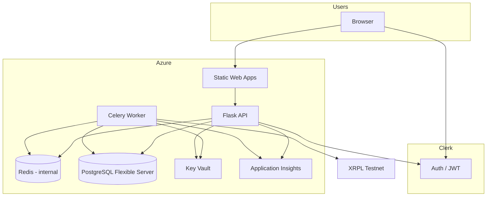

# RemitX Deployment Design — Azure (superseded)

> **Superseded by [2026-08-18-azure-neon-deployment-design.md](./2026-08-18-azure-neon-deployment-design.md).** Original Azure+Postgres design; current path is Azure compute + Neon Postgres + Clerk.

**Date:** 2026-08-16  
**Status:** Historical reference only  
**Project:** UCT ECO5040W — XRPL FX Remittance Platform (RemitX)

## Summary

RemitX deploys across three environments (Local, QA, Production) using **two cloud providers**:

1. **Azure** — compute, database, queue/broker, secrets, observability, custom domains
2. **Clerk** — authentication (React + Flask JWT validation)

Local development uses Docker Compose. QA and Production share the same architecture; QA uses cheaper SKUs and separate databases. All cloud resources are managed with **Terraform**; deployments run through **GitHub Actions**.

Primary goals: **minimal cost** (~$0 on student Azure credits), **simple operations**, and alignment with the project brief (async settlement queue, encrypted XRPL keys, perf testing).

---

## Providers

| Provider | Responsibility |
|---|---|
| **Azure** | Static Web Apps, Container Apps (API, Celery worker, internal Redis), PostgreSQL Flexible Server, Key Vault, Application Insights, DNS/custom domains |
| **Clerk** | User registration, login, session/JWT issuance; React SDK on frontend, JWT verification on Flask API |

No third provider is required for the baseline design. Upstash Redis remains a documented escape hatch if self-hosted Redis on Container Apps becomes problematic.

---

## Environment Model

| Environment | Purpose | Infrastructure | Domain pattern |
|---|---|---|---|
| **Local** | Development | `docker compose -f docker-compose.dev.yml` | `localhost:5173` (frontend), `localhost:4200` (API) |
| **QA** | Integration testing, pre-demo validation | Azure (cheaper SKUs) | `qa.<domain>` or SWA default URL; `api-qa.<domain>` |
| **Production** | Demo, presentation, final delivery | Azure (same architecture, prod SKUs) | `<domain>`; `api.<domain>` |

QA and Production use **identical Terraform modules** with different `tfvars` (resource sizing, naming prefix, Clerk app keys, database name).

Local is **not** Terraform-managed. It mirrors cloud topology via Docker Compose services.

---

## Architecture



### Request flow (authenticated API call)

1. User signs in via **Clerk** (Clerk-hosted UI on free tier).
2. React obtains a Clerk session JWT.
3. Frontend calls Flask API with `Authorization: Bearer <jwt>`.
4. Flask middleware validates JWT against Clerk JWKS (`CLERK_JWKS_URL` / issuer).
5. API reads/writes **PostgreSQL**; enqueues settlement jobs to **Redis** after mock ZAR cash-in confirmation.

### Settlement flow

1. API publishes Celery task to Redis (broker).
2. Celery worker consumes task.
3. Worker loads remittance from Postgres; checks idempotency (status must be `pending_settlement`).
4. Worker decrypts XRPL signing key using encryption key from **Key Vault** (never stored in Postgres).
5. Worker submits RLUSD transfer to **XRPL Testnet**; stores tx hash and updates wallet balance in Postgres.
6. On failure, worker records failure status; task is not retried in a way that double-credits (idempotent by `remittance_id`).

---

## Component Decisions

### Frontend — Azure Static Web Apps

| | Local | QA / Prod |
|---|---|---|
| Runtime | Vite dev server in Docker | Built SPA deployed to SWA |
| Build | `npm run build` | GitHub Actions artifact → SWA deploy |
| Config | `VITE_API_URL`, `VITE_CLERK_PUBLISHABLE_KEY` | Per-environment values in SWA app settings |

SWA Free tier is sufficient. Custom domain on Production; QA may use the default `*.azurestaticapps.net` URL to avoid extra DNS setup.

### API — Azure Container Apps (or App Service F1)

Flask API runs as a container on **Container Apps** (recommended for custom domain + managed TLS) or **App Service F1** (strictest $0 option; custom-domain SSL limitations on F1 documented as QA trade-off).

| | Local | QA / Prod |
|---|---|---|
| Image | Built from `api/Dockerfile` | Same Dockerfile pushed to GitHub Container Registry (free for public repos) or Azure CR if budget allows |
| Scaling | Single container | QA: min 0–1; Prod: min 1 for demo reliability |
| Ingress | `localhost:4200` | External HTTPS at `api-qa.<domain>` / `api.<domain>` |

### Worker — Azure Container Apps (Celery)

Dedicated Container App running `celery -A remitx_worker worker`.

| Setting | Value |
|---|---|
| `minReplicas` | **≥ 1** (Celery must poll continuously) |
| Ingress | **None** (internal only) |
| Connects to | Redis (broker), Postgres, Key Vault, XRPL Testnet (outbound HTTPS) |

Local equivalent: add `worker` service to `docker-compose.dev.yml` with `celery worker` command.

### Redis — Self-hosted on Container Apps (internal)

Redis runs as a **separate Container App** (or sidecar) in the same Container Apps Environment as the worker and API. **No public ingress.**

| Concern | Mitigation |
|---|---|
| Not managed HA | Acceptable for academic prototype; single replica |
| Restart / data loss | Redis is broker only; Postgres is source of truth; settlement jobs are idempotent by `remittance_id` |
| Ops burden | Fully Terraform-managed; upgrade = image tag bump |
| Cost | Near $0 vs Azure Cache for Redis (~$16+/mo minimum) |
| Optional persistence | Azure Files volume mount for Redis AOF if desired |

**Escape hatch:** replace `REDIS_URL` with Upstash Redis URL in Terraform without changing Clerk or overall architecture (temporary third provider acceptable if needed).

### Database — Azure PostgreSQL Flexible Server

| | QA | Prod |
|---|---|---|
| Tier | Burstable **B1MS** | Burstable **B1MS** (same; separate server or separate database on one server) |
| Storage | 32 GB (free tier allowance) | 32 GB |
| Backups | Azure automated | Azure automated |
| Connection | `DATABASE_URL` via Key Vault reference | Same |

Student Azure trial: **750 hours/month B1MS** — sufficient for one always-on instance; avoid provisioning duplicate servers unnecessarily. Prefer **one Flexible Server** with two databases (`remitx_qa`, `remitx_prod`) if quota is tight.

Local: Postgres 16 in Docker Compose (already configured).

### Authentication — Clerk

| Concern | Approach |
|---|---|
| Frontend | `@clerk/react` (or Clerk React Router integration); wrap app in `<ClerkProvider>` |
| Backend | Validate Clerk JWT in Flask `@before_request` middleware using JWKS |
| User identity in DB | Store `clerk_user_id` on local user record; sync on first login |
| Environments | Separate Clerk applications: **Development** (local), **QA**, **Production** |
| Custom domain | Clerk-hosted sign-in on free tier (`*.clerk.accounts.dev`); custom Clerk domain optional (paid) — not required for assignment |

Clerk free tier (10k MAU) is sufficient for the prototype.

### Secrets — Azure Key Vault

| Secret | Stored in | Notes |
|---|---|---|
| `DATABASE_URL` | Key Vault | Referenced by Container Apps / App Service |
| `REDIS_URL` | Key Vault | Internal ACA Redis connection string |
| `XRPL_ENCRYPTION_KEY` | Key Vault | **Must not** live in Postgres (brief requirement) |
| `CLERK_SECRET_KEY` | Key Vault | Backend JWT verification |
| Clerk publishable key | SWA app settings / frontend env | Not secret; safe in build-time env |

GitHub Actions uses **OIDC federation** to Azure (no long-lived Azure credentials in GitHub secrets).

Local: `.env` file (gitignored); `.env.example` documents keys without values.

### Observability — Application Insights

Connected to API and worker for:

- API response times and request rates (perf report)
- Worker task duration and failure rates
- Queue-related metrics via custom events (task enqueued / completed)

Free tier (~5 GB/month) is sufficient.

---

## Custom Domain

User-owned domain mapped as follows:

| Hostname | Target | Environment |
|---|---|---|
| `<domain>` or `www.<domain>` | Static Web Apps | Production (QA optional) |
| `api.<domain>` | Container Apps (API ingress) | Production |
| `api-qa.<domain>` | Container Apps (API ingress) | QA |
| `qa.<domain>` | Static Web Apps | QA (optional) |

**Clerk** uses its own hosted domain for sign-in UI; no Clerk custom domain required on free tier.

**DNS records (at registrar or Azure DNS):**

- `CNAME` for each hostname → Azure-provided verification target
- `TXT` records for Azure domain ownership verification (SWA + ACA each require verification)

**TLS:** Azure managed certificates on Static Web Apps and Container Apps custom domains.

**Clerk allowed origins / redirect URLs:** configure per environment in Clerk dashboard (`localhost:5173`, `qa.<domain>`, `<domain>`).

---

## Local Docker Compose

Existing `docker-compose.dev.yml` services:

| Service | Image / build | Role |
|---|---|---|
| `postgres` | `postgres:16-alpine` | Database |
| `redis` | `redis:7-alpine` | Celery broker |
| `api` | `./api` | Flask API |
| `frontend` | `./frontend` | Vite dev server |

**To add:**

| Service | Command | Role |
|---|---|---|
| `worker` | `celery -A remitx_worker worker` | XRPL settlement consumer |

Local env vars remain in root `.env` (from `.env.example`). No Terraform for local.

---

## Terraform Layout

```text
infra/
├── modules/
│   ├── resource-group/
│   ├── postgresql/          # Flexible Server + databases
│   ├── container-apps-env/  # Shared ACA environment
│   ├── container-app/       # Reusable: api, worker, redis
│   ├── static-web-app/      # Frontend
│   ├── budget-alerts/       # Per-dollar Consumption budgets + action group
│   ├── key-vault/           # Secrets + access policies / RBAC
│   ├── application-insights/
│   └── dns/                 # Optional: Azure DNS zone records
├── envs/
│   ├── qa/
│   │   ├── main.tf
│   │   ├── variables.tf
│   │   ├── terraform.tfvars
│   │   └── backend.tf       # Azure Storage remote state
│   └── prod/
│       ├── main.tf
│       ├── variables.tf
│       ├── terraform.tfvars
│       └── backend.tf
└── README.md
```

### QA vs Prod `tfvars` differences

| Variable | QA | Prod |
|---|---|---|
| `environment` | `qa` | `prod` |
| `postgres_database_name` | `remitx_qa` | `remitx_prod` |
| `api_min_replicas` | 0 | 1 |
| `worker_min_replicas` | 1 | 1 |
| `custom_domain` | optional / empty | `api.<domain>` |
| `swa_custom_domain` | optional | `<domain>` |
| `clerk_publishable_key` | QA key | Prod key |

Modules are identical; only variable values differ.

### Remote state

- Backend: **Azure Storage Account** (one per environment or shared account with separate containers)
- State locking: Azure blob lease
- Never commit `terraform.tfstate` to git

---

## GitHub Actions

### Workflows

| Workflow | Trigger | Actions |
|---|---|---|
| `terraform-qa.yml` | Push to `qa` branch | `terraform plan` on PR; `terraform apply` on merge |
| `terraform-prod.yml` | Push to `main` branch | `terraform plan` on PR; `terraform apply` on merge |
| `deploy-api.yml` | After Terraform or on API path change | Build & push API Docker image; update Container App revision |
| `deploy-worker.yml` | Worker path change | Build & push worker image; update worker Container App |
| `deploy-frontend.yml` | Frontend path change | Build SPA; deploy to Static Web Apps |

### Authentication to Azure

- GitHub Actions **OIDC** → Azure AD federated credential
- Role: `Contributor` scoped to environment resource group (least privilege where possible)
- No `AZURE_CLIENT_SECRET` stored in GitHub

### Secrets in GitHub

Only non-Azure secrets if needed (e.g. Clerk keys for Terraform variables passed at apply time via GitHub Environment secrets). Prefer Key Vault as runtime secret store; GitHub holds deployment credentials only.

---

## Application Configuration Matrix

| Variable | Local | QA | Prod | Source |
|---|---|---|---|---|
| `DATABASE_URL` | `.env` | Key Vault | Key Vault | Terraform → KV |
| `REDIS_URL` | `.env` | Key Vault | Key Vault | Terraform → KV |
| `XRPL_ENCRYPTION_KEY` | `.env` | Key Vault | Key Vault | Manual / TF |
| `CLERK_SECRET_KEY` | `.env` | Key Vault | Key Vault | Clerk dashboard |
| `VITE_API_URL` | `.env` | SWA setting | SWA setting | TF / CI |
| `VITE_CLERK_PUBLISHABLE_KEY` | `.env` | SWA setting | SWA setting | Clerk dashboard |
| `CLERK_JWKS_URL` | `.env` | Key Vault / app setting | Key Vault | Clerk dashboard |
| `DEBUG` | `true` | `true` | `false` | env |

---

## Security Notes

1. **XRPL private keys** encrypted at rest in Postgres; encryption key only in Key Vault.
2. **Clerk JWT** validated on every protected API route; no custom password storage in RemitX DB.
3. **Redis** has no public endpoint; only ACA internal network.
4. **Postgres firewall** allows Azure services + team dev IPs only.
5. **Gitleaks** pre-commit hook remains; `.env` blocked from commits.
6. **QA and Prod** use separate databases and Clerk applications.

---

## Cost Expectations

| Resource | Expected cost (student trial) |
|---|---|
| PostgreSQL B1MS | $0 (750 hrs/month free) |
| Static Web Apps | $0 (Free tier) |
| Container Apps (API + worker + Redis) | ~$0–low (consumption; worker minReplicas=1 is main cost driver) |
| Key Vault | ~$0 (minimal operations) |
| Application Insights | $0 (within free GB) |
| Clerk | $0 (free tier) |
| GitHub Actions | $0 (public repo or included minutes) |

Set Azure **billing alerts** via Terraform (`infra/modules/budget-alerts/`): one email per whole dollar of **Actual** spend up to a configurable monthly cap (default **$20**), using 4 segment budgets per resource group (Azure allows 5 thresholds per budget). Enable subscription-wide segment budgets in **prod only**.

---

## Out of Scope (Prototype)

- Multi-region deployment
- Redis HA / Azure Cache for Redis
- Clerk custom domain (paid)
- Kubernetes (AKS)
- API Management / WAF
- Automated XRPL mainnet (brief forbids mainnet)

---

## Implementation Order

1. Terraform modules: resource group, **budget alerts**, PostgreSQL, Key Vault, Container Apps environment
2. Deploy Redis + worker + API containers to QA
3. Static Web Apps QA deployment
4. Clerk QA app + Flask JWT middleware + React ClerkProvider
5. GitHub Actions: Terraform QA pipeline
6. Celery worker + settlement task (local first, then QA)
7. Custom domain on Production
8. Mirror QA Terraform to Prod with prod `tfvars`

---

## Open Decisions (Deferred)

| Item | Default | Revisit when |
|---|---|---|
| API on App Service F1 vs Container Apps | Container Apps (custom domain TLS) | F1 proves sufficient for QA |
| One Postgres server vs two | One server, two databases | Hitting free-tier hour limits |
| Redis AOF persistence | Off initially | After first Redis restart incident |
| Upstash fallback | Documented only | Redis on ACA causes ops pain |

---

## References

- [Project brief](../../project-brief.md)
- [Azure PostgreSQL free tier](https://azure.microsoft.com/en-us/pricing/details/postgresql/flexible-server/)
- [Clerk React quickstart](https://clerk.com/docs/quickstarts/react)
- [Clerk JWT verification (backend)](https://clerk.com/docs/backend-requests/manual-jwt)
