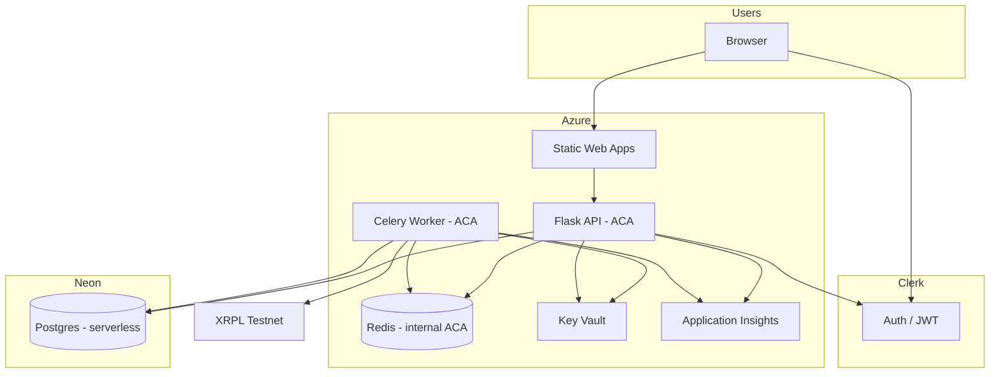

# RemitX Deployment Design — Azure + Neon + Clerk

**Date:** 2026-08-18  
**Status:** Approved  
**Supersedes:** [2026-08-17-aws-deployment-design.md](./2026-08-17-aws-deployment-design.md), [2026-08-17-vercel-deployment-design.md](./2026-08-17-vercel-deployment-design.md), [2026-08-16-deployment-design.md](./2026-08-16-deployment-design.md)

## Summary

RemitX cloud deployment uses **three providers**:

| Provider | Role |
|----------|------|
| **Azure** | Static Web Apps (frontend), Container Apps (API + Celery worker + internal Redis), Key Vault, Application Insights, billing alerts |
| **Neon** | Serverless Postgres (QA + Production branches) |
| **Clerk** | Auth (Development / QA / Production apps) |

**Local** stays on Docker Compose with **Postgres + Redis + Celery** — same topology as cloud (Redis broker, long-running worker), avoiding RabbitMQ/AWS-era drift.

**IaC:** Terraform (`infra/`) for Azure only. Neon is provisioned via Neon console or CLI; connection strings land in Azure Key Vault. **CI/CD:** GitHub Actions with **Azure OIDC** (personal Entra tenant — avoids school-account app-registration blocks).

**Cost target (pay-as-you-go, no credits):** drop Azure Postgres (~$12–15/mo); expect ~**$5–15/mo** Azure (ACA worker + internal Redis always on, API scale-to-zero) + **Neon free tier** + Clerk free tier.

**AWS resources** from the abandoned pivot must be **destroyed** (`RemitXShared`, env stacks, ECR).

---

## Environment model

| | Local | QA | Production |
|--|-------|-----|------------|
| Git branch | any | `qa` | `main` |
| Frontend | Vite `:5173` | Azure Static Web Apps | Azure Static Web Apps |
| API | Flask `:4200` | Container Apps | Container Apps |
| Worker | Celery (Compose) | Container Apps (always on) | Container Apps |
| Postgres | Docker | Neon branch `qa` | Neon branch `main` (or `production`) |
| Redis | Docker | Container Apps (internal) | Container Apps (internal) |
| Clerk app | Development | QA | Production |

### Local / cloud parity

Both use **Celery + Redis** and **PostgreSQL**. Only the Postgres host differs (Docker vs Neon). Local must **not** use RabbitMQ — revert AWS-era RabbitMQ Compose/celery config back to Redis when implementing.

---

## Architecture



### Settlement flow (unchanged from project brief)

1. API enqueues Celery task to **Redis** after simulated ZAR cash-in is confirmed.
2. Worker consumes task; idempotent settlement gate in Postgres.
3. Worker uses **XRPL encryption key** from Key Vault (never returned by API).
4. RLUSD transfer on **XRPL Testnet only**.

---

## Neon

| Item | Choice |
|------|--------|
| Project | One Neon project (e.g. `remitx`) |
| Branches | **`qa`** ← git `qa`; **`main`** (or `production`) ← git `main` |
| Connection string | `postgresql+psycopg2://…?sslmode=require` |
| Terraform | **Not** managed by Terraform (Neon API/console bootstrap) |
| Secrets | Stored in Azure Key Vault per environment as `database-url` |

**Bootstrap (once):**

1. Create Neon project + branches.
2. Copy each branch connection string into Key Vault (`remitx-qa-kv`, `remitx-prod-kv`) or GitHub Environment secrets for first Terraform apply.
3. Schema: `db.create_all()` when `DEBUG=true` locally; cloud uses controlled bootstrap or future Alembic.

Neon free tier limits (storage/compute) are acceptable for the course prototype; monitor in Neon dashboard.

---

## Azure (Terraform)

Restore and adapt modules from PR #1 (`0751fdc`), **excluding Azure PostgreSQL**:

| Module | QA / Prod |
|--------|-------------|
| `resource-group` | ✓ |
| `budget-alerts` | ✓ (prod subscription alerts optional) |
| `key-vault` | ✓ — `database-url` (Neon), `redis-url`, `clerk-*`, `xrpl-encryption-key` |
| `application-insights` | ✓ |
| `container-apps-env` | ✓ |
| `container-app` | API, worker, **internal Redis** (3 apps) |
| `static-web-app` | ✓ frontend |
| ~~`postgresql`~~ | **Removed** — Neon replaces |

### Container Apps sizing (cost-conscious)

| App | minReplicas | Notes |
|-----|-------------|-------|
| API | **0** | Scale to zero when idle |
| Celery worker | **1** | Must consume queue continuously |
| Redis | **1** | Internal ingress only; `redis:7-alpine` |

Internal Redis URL pattern: `redis://<redis-app-name>:6379/0` (ACA internal DNS).

### Secrets — Key Vault

| Secret | Source |
|--------|--------|
| `database-url` | Neon branch connection string (manual → KV) |
| `redis-url` | Terraform output from Redis Container App |
| `clerk-secret-key` | Clerk dashboard → KV |
| `clerk-jwks-url` | Clerk dashboard → KV |
| `clerk-publishable-key` | Clerk dashboard → KV (SWA build) |
| `xrpl-encryption-key` | Generated locally; never commit |

Container Apps reference Key Vault secrets at deploy time (managed identity + RBAC).

---

## Clerk

Three applications (unchanged): **Development** (local `.env`), **QA**, **Production**.

Clerk remains **dashboard-managed** (no Terraform Clerk provider required for MVP). Allowed origins: local URLs, SWA default URLs, custom domains when added.

---

## CI/CD

| Workflow | Trigger | Action |
|----------|---------|--------|
| `ci.yml` | PR, push | pytest, frontend lint/typecheck |
| `terraform-qa.yml` | push `qa` | Terraform plan/apply QA Azure stack |
| `terraform-prod.yml` | push `main` | Terraform plan/apply Prod stack |
| `deploy-api-qa.yml` / `deploy-api-prod.yml` | API/worker changes | Build GHCR image → update ACA revision |
| `deploy-frontend-qa.yml` / `deploy-frontend-prod.yml` | frontend changes | Build SPA → SWA deploy |

**Azure OIDC:** Register Entra app + federated credential for `Katlego-Sekoele/RemitX` on personal tenant (`qa` + `main` refs). No long-lived Azure client secrets in GitHub.

**Container images:** GitHub Container Registry (`ghcr.io`) for API+worker image (same Dockerfile as local).

---

## Git workflow

```
feature/* ──PR──► qa ──PR──► main
                  │           │
            terraform-qa   terraform-prod
            + deploy-*     + deploy-*
```

---

## Local development

```bash
docker compose -f docker-compose.dev.yml up --build
```

Services: **postgres**, **redis**, **api**, **worker**, **frontend**.

`.env.example` documents:

- `DATABASE_URL` → local Postgres
- `REDIS_URL` → local Redis
- `CELERY_BROKER_URL` → not used (celery uses `REDIS_URL` directly)
- Clerk Development keys
- `SKIP_REDIS_TESTS=1` for CI without Redis

---

## Migration from current repo state

| Remove / destroy | Restore / add |
|------------------|-----------------|
| AWS CDK (`infra/cdk/`) | Terraform `infra/modules/`, `infra/envs/qa|prod/` |
| AWS stacks (user action) | Azure pipelines / GitHub workflows from PR #1 |
| RabbitMQ in Compose + `CELERY_BROKER_URL` | Redis in Compose + `REDIS_URL` |
| `docs/DEPLOYMENT.md` (AWS) | Azure + Neon guide |
| Lambda handler, `Dockerfile.lambda` | ACA Dockerfiles from PR #1 |

---

## Destroy order

**AWS (before Azure work):**

```bash
cd infra/cdk && cdk destroy RemitXQa RemitXProd RemitXShared RemitXGitHubOidc
```

**Azure (when tearing down course env):**

```bash
terraform destroy  # per env, then shared state cleanup
```

Neon branches deleted separately in Neon console.

---

## Out of scope

- AWS CDK / Aurora / EC2 RabbitMQ
- Vercel / Upstash
- Azure PostgreSQL Flexible Server
- RabbitMQ in any environment
- XRPL mainnet

---

## Spec self-review

- Neon connection strings are manual bootstrap → documented explicitly.
- Worker `minReplicas=1` is the main remaining Azure cost; API scales to zero.
- Local parity requires Redis revert (explicit in migration table).
- Clerk JWT integration in Flask remains a follow-on app task; infra only wires KV secrets.

---

**Next step:** User reviews this spec → `writing-plans` implementation plan → destroy AWS → restore Terraform → redeploy on personal Azure + Neon.
