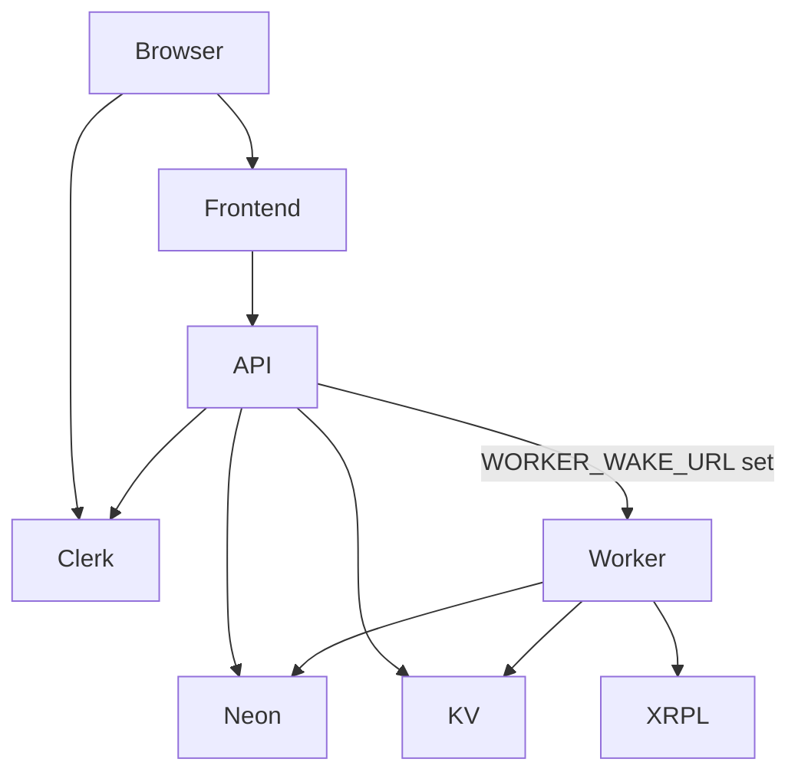

# RemitX Deployment Design — Render + Neon + Clerk

**Date:** 2026-09-12  
**Status:** Approved  
**Supersedes:** [2026-08-18-azure-neon-deployment-design.md](./2026-08-18-azure-neon-deployment-design.md)

## Summary

Cloud compute moves from Azure Container Apps / Static Web Apps / Key Vault to
**Render** (Hobby workspace, free compute plans). **Neon** stays as Postgres.
**Clerk** stays as auth. Redis becomes one Render Key Value instance shared by
QA and Production (logical Redis DBs `/0` and `/1`).

IaC stays Terraform so the GitHub pipeline can keep **plan/apply → migrate →
deploy**. State moves from Azure Storage to **HCP Terraform**. Azure Terraform
is frozen under `infra/legacy-azure/` long enough to destroy the Azure stack,
then that tree can be deleted.

Local development is unchanged: Docker Compose with Postgres + Redis + API +
Celery worker + frontend.

## Constraints

- Render **Hobby** workspace; every compute plan is `free`.
- No `render_background_worker` (no free plan). The worker is a **free web
  service** that serves `GET /health` and runs Celery.
- No Render Postgres (30-day free expiry). Neon branches stay.
- One free Key Value per workspace.
- Hobby includes **two** custom domains. Production uses them
  (`remitx.tech`, `api.remitx.tech`). QA uses `*.onrender.com`.
- Auto-deploy is **off**. GitHub Actions triggers Render deploys after CI,
  Terraform, and Alembic succeed.
- `WORKER_WAKE_URL` gates the HTTP wake. Unset means producer-only (local, or
  a future always-on worker).
- XRPL Testnet only. Keys never logged, returned, or committed.

## Environment model

| | Local | QA (`main`) | Production (`stable`) |
|--|-------|-------------|------------------------|
| Frontend | Vite `:5173` | Static site (`*.onrender.com`) | Static site → `remitx.tech` |
| API | FastAPI `$PORT` (default 4200) | Free web service, Docker | Free web service → `api.remitx.tech` |
| Worker | Compose Celery | Free web service (HTTP + Celery) | Free web service (HTTP + Celery) |
| Postgres | Docker | Neon branch `qa` | Neon branch `main` / `production` |
| Redis | Docker | Key Value `/0` | same instance `/1` |
| Auth | Clerk Development | Clerk QA | Clerk Production |
| Secrets | `.env` | Render env vars via Terraform | same |
| State | n/a | HCP workspace `remitx-qa` | HCP workspace `remitx-prod` |

Shared Key Value lives in HCP workspace `remitx-shared`.

Region: **Frankfurt**.

## Architecture



Settlement: API enqueues a Celery task on Redis, then if `WORKER_WAKE_URL` is
set, fire-and-forget `GET` that URL so a spun-down free worker starts. The API
response does not wait on the ping. On worker boot, reclaim `PENDING`
integration messages from Postgres (free Key Value is ephemeral). Settlement
stays idempotent.

Free web services cannot receive private-network traffic. The wake URL is the
worker's **public** `https://…onrender.com/health`.

## Terraform

```
infra/
  shared/                 # Key Value + project; modules nested at ./modules
  envs/qa/                # HCP remitx-qa; ./modules/web_service + static_site
  envs/prod/              # HCP remitx-prod; same nested modules
  legacy-azure/           # destroy-only Azure roots

Modules sit inside each root so HCP remote plans (which upload only that
directory) can resolve `source = "./modules/..."`.
```

Provider: [`render-oss/render` 1.9.1](https://registry.terraform.io/providers/render-oss/render/latest/docs). `skip_deploy_after_service_update = true`. `auto_deploy_trigger = "off"`.

Secrets (GitHub environment → `TF_VAR_*` → Render env vars):

| Variable | Lands on |
|----------|----------|
| `DATABASE_URL` | API + worker (Neon, SQLAlchemy form) |
| `REDIS_URL` | API + worker (internal KV URL + logical DB) |
| `CLERK_SECRET_KEY` | API + worker |
| `XRPL_ENCRYPTION_KEY` | API + worker |
| `WORKER_WAKE_URL` | API only (worker's public `/health`) |
| `CORS_ORIGINS` | API (frontend URL) |
| `VITE_API_URL` / `VITE_SITE_URL` / `VITE_CLERK_PUBLISHABLE_KEY` | frontend build |

`MIGRATIONS_DATABASE_URL` stays a GitHub secret (same Neon URL; Actions is
outside Render so it uses the Neon host, not an internal Render URL).

## Pipeline

`deploy.yml` job graph is unchanged: `changes` → `ci` → `terraform` →
`migrate` → `deploy-api` / `deploy-worker` / `deploy-frontend`.

- `terraform`: HCP token + `TF_VAR_render_api_key` / `TF_VAR_render_owner_id`
  (mapped from GitHub `RENDER_*`; HCP does not inherit provider env vars).
  Always apply `infra/shared` (creates state and authorizes qa/prod as
  remote-state consumers), then plan
  (PR) or apply (push) `infra/envs/{qa,prod}`. Always emit service IDs as job
  outputs on push.
- `migrate`: unchanged (`alembic upgrade head` against
  `MIGRATIONS_DATABASE_URL`).
- Deploy jobs: `POST https://api.render.com/v1/services/{id}/deploys`. No
  GHCR, no Azure, no SWA token. The `paused` skip is removed.

## App changes

1. API image runs `python -m remitx_api` (already binds `0.0.0.0:$PORT`).
2. Worker image runs `python -m remitx_worker`: daemon HTTP `/health` on
   `$PORT` plus Celery.
3. `queue_service.enqueue_integration_message` calls `wake_worker()` after
   `send_task`. Empty `WORKER_WAKE_URL` is a no-op. Wake errors are logged,
   never raised.
4. `worker_ready` reclaims `PENDING` rows and re-enqueues them.

Local Compose does not set `WORKER_WAKE_URL` and still starts Celery directly.

## Cutover

1. Bootstrap Hobby workspace, an HCP org (`TF_CLOUD_ORGANIZATION`),
   workspaces `remitx-shared` / `remitx-qa` / `remitx-prod`, and a Render
   API key. Put secrets and `TF_CLOUD_ORGANIZATION` on GitHub `qa` / `prod`.
2. Destroy Azure from `infra/legacy-azure/envs/{qa,prod}` against the existing
   Azure state backend. Delete Azure resource groups, the tfstate account,
   Entra OIDC, and Azure/SWA/GHCR GitHub secrets. **Do not delete Neon.**
3. Apply shared + QA + Production. Push `main` / `stable` so migrate + Render
   deploys run.
4. Point `remitx.tech` and `api.remitx.tech` at Production. Update Clerk
   origins; drop Azure hosts.

## Out of scope

- Render Postgres
- Render background workers
- Paying for extra custom domains (QA branded names)
- Dump/restore of Neon data
- XRPL mainnet
- Azure Key Vault / Application Insights replacements beyond Render logs

## Spec self-review

- Neon kept; 30-day Render Postgres runbook removed.
- Wake is optional via `WORKER_WAKE_URL`.
- One Key Value, two logical DBs; Hobby two-domain limit respected.
- Destroy-first; Neon survives.
- Pipeline still gates deploys on migrate success.
